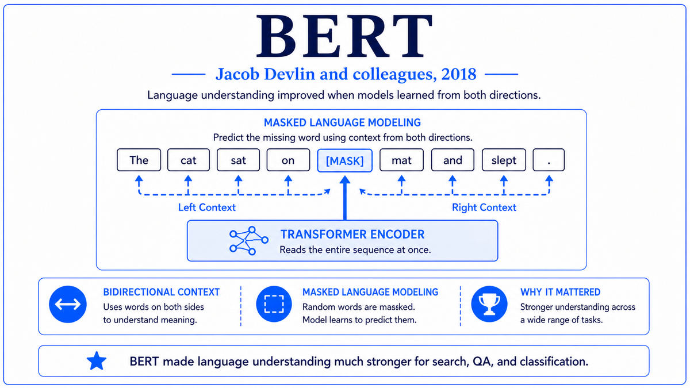

  

  <a href="https://cdn.openai.com/better-language-models/language_models_are_unsupervised_multitask_learners.pdf">📄 Original Paper (OpenAI, February 2019)</a> · Alec Radford (Born United States), Jeffrey Wu, Rewon Child, David Luan, Dario Amodei (Born Italy, 1983), Ilya Sutskever (Born Nizhny Novgorod, Russia, 1986), OpenAI

<em>Four months after BERT, OpenAI released a model that could write coherent essays from a one-sentence prompt. Then they refused to release it. The age of generative language models, and the debate over its safety, both began that day.</em>

---

In June 2018, Alec Radford and a small team at OpenAI had published a paper titled "Improving Language Understanding by Generative Pre-Training." The work, which became known as GPT-1, applied the Transformer decoder to autoregressive language modeling on the BookCorpus dataset. With 117 million parameters, GPT-1 set new benchmarks on several NLP tasks but was overshadowed four months later by BERT, which used the encoder side of the same architecture and produced even stronger results. Most observers concluded that the encoder direction was the right one and the decoder lineage would remain a footnote.

Radford was not convinced. Born in the United States, he had joined OpenAI in 2016 after studying at Olin College of Engineering. His earlier work had included DCGAN, a foundational paper in generative image models, and he had developed a strong intuition that scale and generative pretraining were structurally more powerful than discriminative encoding. The team around him at OpenAI included Jeffrey Wu, Rewon Child, David Luan, and Dario Amodei, born in Italy in 1983, who had joined OpenAI from Google Brain and would later co-found Anthropic. The senior author was Ilya Sutskever, born in Nizhny Novgorod, Russia, in 1986, OpenAI's co-founder and chief scientist, already a veteran of seq2seq and AlphaGo before joining OpenAI in 2015.

The team made a decision that would define the next several years of AI research. They did not change the GPT-1 architecture in any meaningful way. They did not invent a new training objective. They simply scaled. The model size grew from 117 million parameters to 1.5 billion. The training data grew from BookCorpus, a few thousand books, to WebText, a curated corpus of 8 million web pages totaling 40 gigabytes of text. The compute grew accordingly. Beyond that, the recipe was unchanged. The result was a model that could do things its predecessor could not.

The most striking property was zero-shot multitask learning. Given a prompt that described a task, GPT-2 could often perform it with no fine-tuning. Asked to summarize an article by appending the phrase "TL;DR" at the end, it would produce a reasonable summary. Asked to translate a sentence by giving it the format "English: [sentence] French:", it would produce a French translation. Asked to answer questions about a passage, it would do so. None of these tasks had been explicitly part of the training objective, which was simply to predict the next token in WebText. The model had learned them as a byproduct of needing to predict tokens correctly across the full diversity of internet text.

The paper was titled "Language Models are Unsupervised Multitask Learners," a deliberate echo of the way the field had been conceptualized for years. The decision OpenAI made next was unprecedented. Citing concerns about misuse, including disinformation generation and impersonation, OpenAI declined to release the full 1.5 billion parameter model. They released only the smallest version, 124 million parameters, in February 2019. They followed with a 355 million parameter version in May, a 774 million parameter version in August, and finally the full 1.5 billion model in November 2019, after they had observed that no major misuse had occurred with the smaller models. The staged release strategy provoked vigorous public debate about responsible release of AI systems, a debate that has continued ever since.

  

<em>Same architecture. Bigger model. Better data. The result was new in kind, not just in degree.</em>

---

GPT-2 mattered for three reasons that compounded over the following years.

First, it was the first clear demonstration that scaling the same architecture, with no fundamental algorithmic changes, produced qualitatively new capabilities. GPT-1 could not produce coherent multi-paragraph text. GPT-2 could. The difference was not in the algorithm but in the parameter count and the data. The lesson generalized. Within OpenAI and increasingly elsewhere, researchers began to consider scale as a primary research direction, not a secondary engineering concern. The scaling laws paper from January 2020 would formalize this intuition into mathematics, but the first compelling evidence had come from GPT-2.

Second, GPT-2 established the autoregressive decoder lineage as the foundation of what would become large language models. Before GPT-2, BERT and its variants had appeared to be winning the NLP architecture competition. After GPT-2, the picture was reversed. Generation, not just understanding, was where the field was heading. Encoders were good for classification and extraction. Decoders could classify, extract, generate, translate, summarize, and complete arbitrary natural language tasks given the right prompt. The unification of NLP capabilities under a single autoregressive model was the trajectory that would lead, three years later, to ChatGPT.

Third, the staged release brought AI safety considerations into the public discourse for the first time around a frontier capability model. Before February 2019, AI safety had been a niche concern within the research community. After OpenAI publicly justified withholding GPT-2's full weights on safety grounds, every major research group had to think about release strategies, every major news outlet had to cover AI safety, and a generation of researchers entered the field with the question of safe release as part of the normal vocabulary. Whether or not GPT-2 actually warranted the caution, the staged release set a precedent that has shaped every frontier release since.

---

The defining concept of GPT-2 is that scale, applied to a sufficiently general training objective, elicits emergent capabilities. The training objective was the simplest possible. Predict the next token given the previous tokens, on a corpus drawn from the open web. There is no task-specific structure in this objective. Yet a model trained well on it must, in order to predict next tokens accurately, build internal models of grammar, factual knowledge, reasoning patterns, narrative structure, dialogue conventions, and a long list of other phenomena that appear in the data. As the model gets larger and the data more varied, more of these phenomena are captured.

Zero-shot transfer is the practical manifestation of this principle. To perform a new task with GPT-2, you do not fine-tune the model. You write a prompt that describes the task in natural language, often by giving it the format the answer should take, and the model attempts the task by continuing the prompt. This works because the model has seen many instances of similar tasks, in similar formats, scattered through its training data. Translation, summarization, question answering, simple arithmetic, and many other tasks emerge for free, with varying levels of accuracy.

The conceptual shift here is from training-time supervision to inference-time prompting. With BERT, you fine-tune for the task, providing labeled examples. With GPT-2, you prompt for the task, providing only a description and possibly a few in-context examples. The same model serves all tasks. The cost of using the model for a new task drops from hours of fine-tuning to seconds of prompting. This shift, which would become explicit and central with GPT-3 a year later, was first made visible by GPT-2.

---

GPT-2's architecture is a decoder-only Transformer with masked self-attention so that each position can only attend to previous positions. The base GPT-2 has 12 layers, hidden dimension 768, and 117 million parameters. The largest version has 48 layers, hidden dimension 1600, and 1.5 billion parameters. Layer normalization is moved to the input of each sublayer, a small change from the original Transformer that improves training stability. The activation function is GELU rather than ReLU. The vocabulary uses byte-pair encoding tokenization with 50,257 tokens, designed to handle arbitrary unicode text without out-of-vocabulary issues.

The training objective is standard autoregressive language modeling. Given a sequence of tokens x_1, x_2, ..., x_n, the model is trained to maximize the conditional probability of each token given the previous ones, written as the product over positions of p(x_t given x_1 through x_{t-1}). Equivalently, the loss is the sum of negative log probabilities at each position. The model is trained with the Adam optimizer, a context length of 1024 tokens, and a batch size of 512. Training of the largest version took several weeks on a cluster of NVIDIA V100 GPUs.

The training data, called WebText, was constructed by scraping all outbound links from Reddit posts that had received at least three karma points. The Reddit karma threshold served as a coarse human-curated filter for content quality. After deduplication and Wikipedia removal to avoid leakage with downstream evaluations, WebText totaled 40 gigabytes of text, roughly 8 million documents. The choice to use Reddit-filtered web text was a small but consequential one. It produced training data that was generally more coherent and diverse than raw Common Crawl, and it became a template that subsequent models would refine.

---

The reception of GPT-2 was loud. Major news outlets ran articles asking whether the model was dangerous. Researchers debated the staged release. Within months, several other groups had reproduced models of comparable size, and a few had released their weights openly. The misuse OpenAI had feared did not materialize at scale, and the full 1.5 billion parameter model was released in November 2019.

Within OpenAI, the team's reaction was different. They had run a careful experiment in scale and the result had been unambiguously positive. The natural question was whether the same trend would continue if they pushed by another order of magnitude. In January 2020, Jared Kaplan and colleagues at OpenAI published a paper that put the question on a quantitative footing. They showed that loss followed predictable power-law relationships with model size, dataset size, and compute. The implication was that capabilities would continue to improve smoothly as you scaled, with no obvious wall in sight. The team began work on a model 100 times larger than GPT-2. They would call it GPT-3, and its arrival five months later would change what people thought a language model could do.

---

  <a href="2018-Devlin-BERT.md">← Previous: BERT 2018</a> &nbsp;·&nbsp; <a href="2020a-Brown-GPT-3.md">Next: GPT-3 2020 →</a>

