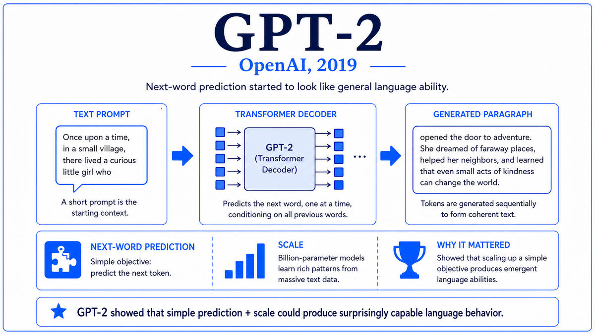

  

  <a href="https://arxiv.org/pdf/2005.14165">📄 Original Paper (NeurIPS 2020)</a> · Tom B. Brown (Born United States), Benjamin Mann, Nick Ryder, Melanie Subbiah, Jared Kaplan (Born United States), Sam McCandlish, Dario Amodei (Born Italy, 1983), Ilya Sutskever (Born Nizhny Novgorod, Russia, 1986), and 23 others, OpenAI

<em>OpenAI built a model 100 times larger than GPT-2 and discovered that it could learn new tasks from a few examples in its prompt. The capability had no name and no precedent. They called it in-context learning, and it changed what a language model was for.</em>

---

In January 2020, four months before the GPT-3 paper was uploaded to arXiv, a smaller paper from the same lab had laid the conceptual groundwork. Jared Kaplan, born in the United States, was a theoretical physicist at Johns Hopkins who had been collaborating with OpenAI on scaling phenomena in neural networks. With Sam McCandlish and several others, he published "Scaling Laws for Neural Language Models." The paper's central claim was that the test loss of a language model follows predictable power-law relationships with three quantities. Model size in parameters, training dataset size in tokens, and compute used during training. As any one is scaled up, holding the others fixed, the loss decreases according to a clean power law. The scaling laws gave OpenAI a quantitative basis for the bet they were about to make. If you scale all three together, performance keeps improving smoothly, and you can predict in advance roughly how much it will improve.

Armed with this analysis, OpenAI committed to a model 100 times larger than GPT-2. The lead author of the resulting paper was Tom B. Brown, born in the United States, an OpenAI engineer who had previously worked on infrastructure and reinforcement learning. The author list included 31 people, reflecting the scale of the engineering effort required. The model had 175 billion parameters, organized into 96 transformer layers with hidden dimension 12288 and 96 attention heads. It was trained on 300 billion tokens drawn from a curated mixture of Common Crawl, WebText2, two book corpora, and English Wikipedia. The training run took several weeks on a Microsoft Azure cluster of thousands of V100 GPUs and cost an estimated four to twelve million dollars in raw compute. No prior published model had been trained at this scale.

The architectural changes from GPT-2 were minor. The team kept the same decoder-only Transformer, the same byte-pair encoding tokenizer, and the same autoregressive objective. The only meaningful change was the use of alternating dense and locally banded sparse attention patterns to reduce compute on long sequences. The bet was once again that scale alone, applied to the same architecture, would produce new capabilities. The bet paid off.

The capability that surprised the team most was in-context learning. When given a prompt that included a few examples of a task, GPT-3 could perform that task on new inputs without any gradient updates. Show the model three examples of English sentences and their French translations, then give it an English sentence, and it would produce the French translation. Show it three examples of arithmetic addition, then give it a new addition problem, and it would often solve it correctly. The model had not been trained to do translation or arithmetic specifically. It had simply learned, from predicting tokens on the open web, that when a pattern of input-output pairs appears in context, the rational continuation is to apply that pattern to the next input. Few-shot learning had emerged as a byproduct of scale.

The paper, titled "Language Models are Few-Shot Learners," was uploaded to arXiv on May 28, 2020, and presented at NeurIPS in December 2020 where it won the best paper award. The 75-page document evaluated GPT-3 on dozens of benchmarks across translation, question answering, reasoning, arithmetic, code generation, and many other tasks. The model's performance varied widely. On some tasks it was state-of-the-art with zero or few-shot prompting. On others it was mediocre. But the breadth of capabilities elicited from a single model with a single prompting interface was unlike anything the field had seen.

  

<em>Three examples and a new input. No fine-tuning, no gradient updates. The pattern was inferred at inference time.</em>

---

GPT-3 mattered for three reasons that defined the next phase of the field.

First, it validated the scaling laws empirically and made them the central thesis of frontier AI research. After GPT-3, every major lab oriented around scale as a primary lever. Compute budgets grew. Cluster sizes grew. Datasets grew. The question shifted from "what architecture should we use" to "how big can we go." This orientation has dominated AI research from 2020 to the present, and it traces directly to GPT-3 demonstrating that the Kaplan scaling laws were not just theoretical curves but a reliable map of capability gains.

Second, GPT-3 introduced the API as the deployment model for frontier AI. OpenAI did not release the model's weights. They built a paid service through which developers could query the model with prompts and receive completions. Within a year, an ecosystem had formed around this API. Companies like Jasper, Copy.ai, and dozens of others built products on top of it. GitHub Copilot, launched in 2021, was a fine-tuned version of GPT-3 specialized for code. The closed-weights, pay-per-token deployment model has become the standard for commercial frontier AI, used by Anthropic, Google, and most other major providers. The template was set by GPT-3.

Third, in-context learning changed how people thought about adapting models to tasks. Before GPT-3, adapting a model to a new task meant fine-tuning, which required labeled training data, GPU time, and machine learning expertise. After GPT-3, for many tasks, adapting a model meant writing a prompt. Anyone who could write English could specify a task and get a result. This collapsed the barrier between machine learning expertise and the use of machine learning. Prompting became its own informal craft, with practitioners trading techniques and best practices in blog posts and tweets. The democratization of model usage, which would explode with ChatGPT two years later, began here.

---

The defining concept of GPT-3 is in-context learning, sometimes called few-shot learning or meta-learning. The model adapts to a new task at inference time, based purely on the contents of its prompt, with no parameter updates. This is qualitatively different from traditional fine-tuning, which requires labeled data and a training run.

The way it works is simple to describe and surprisingly hard to fully explain. The prompt contains a description of the task, a few example input-output pairs, and the new input. The model continues the prompt. If the task description and examples were patterned correctly, the continuation will be the answer to the new input. Three regimes are commonly distinguished. Zero-shot, where the prompt has only a task description. One-shot, where there is a single example. Few-shot, where there are several examples. GPT-3 is competent in all three regimes, with few-shot generally producing the best results.

Why does in-context learning work? The mechanistic answer is that the model has been trained on a corpus large and diverse enough to contain many instances of demonstration-like patterns. Educational materials show worked examples followed by problems. Documentation shows API examples followed by usage. Translations come in pairs. Question-answer formats are everywhere on the web. By learning to predict tokens accurately across this diversity, the model implicitly learns to recognize and continue demonstration patterns. When a user provides a few demonstrations in a prompt, the model is in distribution. It does what its training has prepared it to do.

The conceptual depth here is that the model is performing a kind of implicit meta-learning. It is not just learning patterns from data but learning how to learn from a few examples within a single forward pass. This is a much more powerful capability than the gradient-based fine-tuning it replaces, because it operates at inference time, requires no compute beyond the forward pass, and generalizes across any task that fits in the prompt. The full implications of this would take several years to work out and are still being explored.

---

The Kaplan scaling laws can be summarized in two key equations. For a model trained to convergence with sufficient data, the loss as a function of parameter count N follows roughly L(N) approximately equal to (N_c divided by N) raised to a small positive exponent alpha, where N_c is a constant. Holding model size fixed and scaling data D, the loss follows a similar power law with its own exponent. When all three of model size, data, and compute are scaled together optimally, the loss continues to decrease as a power law in compute with no observed plateau.

The GPT-3 architecture follows the GPT-2 recipe. A decoder-only Transformer with masked self-attention and GELU activations. The largest model has 175 billion parameters in 96 layers, with hidden dimension 12288, 96 attention heads of dimension 128. The context length is 2048 tokens. The model was trained for 300 billion tokens, less than one full pass over its training corpus, on Microsoft Azure clusters of thousands of V100 GPUs.

The training corpus was a curated mixture. Common Crawl filtered for quality contributed 60 percent. WebText2 contributed 22 percent. Two book corpora contributed 8 percent each. English Wikipedia contributed 3 percent. Common Crawl was filtered using a classifier trained to distinguish high-quality reference text from raw web pages, then deduplicated.

The Chinchilla paper from DeepMind in 2022 would later show that the Kaplan scaling laws had systematically underweighted data. For a fixed compute budget, the optimal split allocates roughly equal compute to scaling parameters and scaling data. By that revised analysis, GPT-3 was undertrained for its size. The Chinchilla finding revised the field's understanding of optimal scaling, but did not change the fundamental conclusion that scale produces capability.

---

The aftermath of GPT-3 shaped the AI landscape for the years that followed. The OpenAI API launched in June 2020 and quickly became one of the fastest-growing developer products in technology. Codex, a fine-tuned variant for code, launched in 2021 and became the engine behind GitHub Copilot. Anthropic, founded in 2021 by former OpenAI researchers including Dario Amodei and his sister Daniela, began building competing models. Cohere, AI21, and others followed. The closed-weights API economy that GPT-3 inaugurated would within three years be a major industry.

The scaling laws also began driving research in other domains. If language could be cracked by scaling Transformers on web text, what about other modalities? What about other scientific problems? Within months, several teams were applying similar approaches to vision, audio, and code. One team in particular, working at DeepMind in London, was applying massive compute to a problem that had stymied biology for half a century. Their target was protein structure prediction, and the result they were preparing to announce in November 2020 would solve a 50-year-old grand challenge in molecular biology.

---

  <a href="2019-Radford-GPT-2.md">← Previous: GPT-2 2019</a> &nbsp;·&nbsp; <a href="2020b-Jumper-AlphaFold-2.md">Next: AlphaFold 2 2020 →</a>

