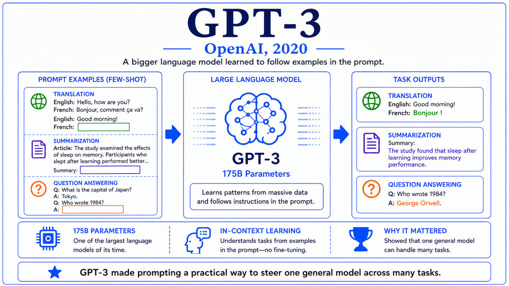

  

  <a href="https://www.nature.com/articles/s41586-021-03819-2">📄 Original Paper (Nature 2021)</a> · John Jumper (Born United States, 1985), Richard Evans, Alexander Pritzel, Tim Green, Michael Figurnov, Olaf Ronneberger (Born Germany), Demis Hassabis (Born London, 1976), and 26 others, DeepMind, London

<em>For fifty years, predicting a protein's 3D structure from its amino acid sequence had been one of biology's grand challenges. In November 2020, a team at DeepMind announced they had solved it. The proof was a competition score that nobody had thought possible.</em>

---

A protein is a chain of amino acids that folds into a three-dimensional shape. The shape determines what the protein does. Hemoglobin transports oxygen because of the way it folds. Insulin regulates blood sugar because of its shape. Antibodies recognize pathogens because their folded structure presents specific binding surfaces. The amino acid sequence is encoded in DNA and is easy to read. The 3D structure is much harder to obtain. For decades, the only reliable methods were X-ray crystallography and cryo-electron microscopy, each requiring months or years of laboratory work per protein. The gap between sequenced proteins and structurally characterized proteins grew steadily. By 2020, fewer than 200,000 proteins had experimentally determined structures, while hundreds of millions had sequences known from genome data.

In 1994, John Moult organized the first Critical Assessment of Protein Structure Prediction competition, known as CASP. Every two years, computational groups received protein sequences whose structures had been determined experimentally but not yet released, and they had to predict the structures. The Global Distance Test, called GDT, scored predictions by how closely the predicted atom positions matched the experimental ones. A score of 100 was perfect. A score of around 90 was considered comparable to experimental accuracy. For two decades, the best methods had hovered between 30 and 50. The problem was widely considered intractable in any general sense.

DeepMind's first attempt was AlphaFold 1, which competed at CASP13 in 2018 and produced a median GDT_TS of about 58, a meaningful improvement but not transformative. The team then went back to first principles. The lead researcher was John Jumper, born in the United States in 1985, who had a PhD in theoretical chemistry from the University of Chicago and had joined DeepMind in 2017. Demis Hassabis, born in London in 1976 and already covered earlier in this walk, was the senior author. The team rebuilt the system from scratch, dropping nearly every component of AlphaFold 1 and replacing it with a transformer-based architecture they called the Evoformer.

The key insight was that evolutionary information, encoded in the multiple sequence alignment of a protein with its homologs across species, contains rich signal about which amino acids contact each other in the folded structure. If two amino acid positions co-vary across evolutionary history, they are likely in physical contact, because mutations in one position constrain compatible mutations in its contact partner. AlphaFold 2 processed multiple sequence alignments and pairwise residue features jointly, with attention layers that let any pair of positions exchange information. After 48 layers of this Evoformer, a separate structure module produced the actual 3D coordinates of every atom in the protein, equivariantly under rotation and translation, with iterative refinement.

The team submitted predictions to CASP14 in November 2020. The results were unprecedented. The median GDT_TS score across the assessment targets was 92.4. For two-thirds of the targets, the predictions were within experimental accuracy. The CASP organizers stated that the protein structure prediction problem had been "essentially solved" for single-chain proteins. John Moult, who had founded CASP precisely to track progress on a problem he considered very hard, said in his keynote that the field had reached a result he had not expected to see in his lifetime. The full paper was published in Nature in July 2021, with the title "Highly accurate protein structure prediction with AlphaFold." DeepMind released the code, and shortly afterward released a database of predicted structures for 350,000 proteins, expanding within a year to 200 million, essentially every protein known to science.

  

<em>Evolutionary signal flowing through attention layers, then becoming geometry. The architecture that solved a fifty-year problem.</em>

---

AlphaFold 2 mattered for three reasons that extended well beyond machine learning.

First, it solved a grand challenge in biology. Protein folding had been described as a problem of comparable importance to deciphering the genetic code, and it had remained open for fifty years. The CASP organizers' statement that the problem had been "essentially solved" was carefully worded but unambiguous. For a vast class of single-chain proteins, computational prediction could now substitute for experimental determination. The acceleration of structural biology was immediate. Researchers who had spent careers determining a handful of structures could now obtain predicted structures for any protein of interest in a few hours of GPU time.

Second, it changed the methodology of computational biology. Before AlphaFold 2, computational predictions of protein structure were primarily checked, refined, and supplemented by experimental work. After AlphaFold 2, computational predictions became the starting point for most structural biology projects, with experimental work focused on cases where predictions were uncertain or where dynamic information was needed. The AlphaFold protein structure database, freely accessible through EMBL-EBI, has become as central to molecular biology as GenBank or PDB. Its 200 million predicted structures cover essentially every catalogued protein in nature.

Third, AlphaFold 2 demonstrated that the deep learning toolkit, particularly transformer-based architectures combined with massive compute and domain-appropriate inductive biases, could crack scientific problems beyond natural language and computer vision. The example accelerated similar efforts across other domains. Within a few years, deep learning systems had been applied to weather forecasting, fluid dynamics, materials discovery, and dozens of other scientific problems with significant success. The 2024 Nobel Prize in Chemistry, awarded to Jumper and Hassabis along with David Baker, recognized AlphaFold as a foundational scientific contribution. It was the first time a Nobel had been awarded for a deep learning result.

---

The defining concept of AlphaFold 2 is the joint use of evolutionary signal and geometric inductive bias, processed by attention layers that bring information from anywhere in the protein to bear on every prediction.

Evolutionary signal comes from multiple sequence alignment. Given a target protein, the system retrieves homologous protein sequences from across the tree of life and aligns them. The aligned MSA is a matrix where each row is a related sequence and each column is a position in the target. Patterns in this matrix carry information about structure. Conserved positions are usually in functional regions. Co-varying positions are usually in physical contact. The MSA is the data that lets prediction work.

The Evoformer is the architecture that processes this data. It maintains two representations simultaneously. One is the MSA itself, processed by attention along both rows and columns. The other is a pairwise representation indexed by pairs of residues, which holds information about distances and orientations between every pair of positions. The Evoformer alternates updates between these two representations. The MSA is updated using attention informed by the pair representation, and the pair representation is updated using the MSA via a triangular update operation that maintains geometric consistency. After 48 such blocks, the representations encode enough structural information for explicit 3D coordinate prediction.

The structure module then produces the geometry. It treats each amino acid as a rigid frame and predicts the rotation and translation of each frame in 3D space, plus the side chain torsion angles. The prediction is iterated multiple times, with each iteration refining the previous one. At each step, the module is equivariant under global rotations and translations of the protein, so that the predicted structure does not depend on the arbitrary choice of coordinate frame. The final output is a complete atomic-resolution 3D structure with confidence scores for every residue.

---

The Evoformer block operates on two tensors. The MSA representation has shape s by r by c, where s is the number of sequences in the MSA, r is the number of residues, and c is the channel dimension. The pair representation has shape r by r by c, indexed by all pairs of residues. The block alternates several operations. Row-wise gated self-attention along the MSA, biased by the pair representation. Column-wise self-attention along the MSA. A transition layer for the MSA. Then for the pair representation, outer product mean from the MSA into the pair, triangle multiplicative updates, triangle self-attention, and a transition layer. The triangular operations enforce consistency among triples of positions.

The structure module operates on the final MSA target row and the final pair representation. It produces, for each residue, a backbone frame consisting of a rotation matrix and a translation vector, plus seven torsion angles for the side chain. At each iteration, an Invariant Point Attention operation lets each residue query others using their relative geometry, producing updates to its own frame. The structure module runs eight iterations. The full pipeline runs three times in a recycling step, so the final structure has been refined 24 times.

Training used the Protein Data Bank as the source of structures, with about 170,000 structures after filtering. The model has approximately 93 million parameters. Loss is a combination of FAPE (Frame Aligned Point Error) and several auxiliary losses including distogram prediction and MSA reconstruction. Training took several weeks on a Google TPU pod. Inference for a single protein takes a few minutes on a GPU.

---

The release of the AlphaFold protein structure database, expanding from 350,000 entries in 2021 to 200 million entries in 2022, has fundamentally changed structural biology and drug discovery. Within months of its release, hundreds of papers were citing AlphaFold predictions. By 2024, structures of essentially every catalogued natural protein were available freely. AlphaFold 3, released in May 2024, extended the approach to protein-protein, protein-ligand, and protein-nucleic-acid complexes. The 2024 Nobel Prize in Chemistry was awarded jointly to Jumper, Hassabis, and David Baker, with Baker recognized for his complementary work on protein design.

The success of AlphaFold 2 reinforced a lesson the rest of AI had also been learning. Scale and the right architecture, applied with care to a domain's natural structure, produced results that earlier approaches had not. The same lesson was driving the parallel explosion in language modeling and would soon drive comparable progress in image generation, code generation, and dozens of other domains.

But all of these advances were hitting a wall on the hardware side. GPT-3 had pushed training to clusters of thousands of NVIDIA V100 GPUs. AlphaFold 2 had used substantial TPU time. The next generation of frontier models would require still more compute. NVIDIA had been working since 2018 on the chip that would meet the moment. In May 2020, two weeks before the GPT-3 paper went up on arXiv, NVIDIA had unveiled it. They called it the A100, and for the next three years it would be the chip that trained almost everything.

---

  <a href="2020a-Brown-GPT-3.md">← Previous: GPT-3 2020</a> &nbsp;·&nbsp; <a href="2020c-NVIDIA-A100.md">Next: NVIDIA A100 2020 →</a>

