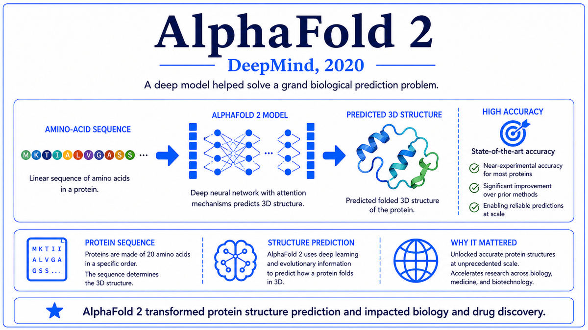

  

  <a href="https://www.nvidia.com/en-us/data-center/a100/">📄 Product Announcement (NVIDIA, May 2020)</a> · Jensen Huang (Born Tainan, Taiwan, 1963), Bill Dally (Born United States, 1960), and the NVIDIA Ampere architecture team, Santa Clara, California

<em>On May 14, 2020, Jensen Huang pulled an eight-GPU board out of his kitchen oven on a livestream. The piece of silicon inside was the chip that would train GPT-3, ChatGPT, AlphaFold 2, Stable Diffusion, and almost every other frontier model of the next three years.</em>

---

The COVID-19 pandemic shut down conferences in March 2020. NVIDIA's GPU Technology Conference, scheduled for late March in San Jose, was cancelled along with everything else. Jensen Huang, born in Tainan, Taiwan in 1963, decided that the company would deliver the keynote anyway, virtually, from his home. On May 14, 2020, in a now-iconic moment, Huang stood in his kitchen and pulled the new DGX A100 board from his oven, wearing oven mitts. The board contained eight A100 GPUs and was, he announced, the world's most advanced AI system. It happened to be the largest chip ever shipped by NVIDIA at the time, and the largest chip ever produced on TSMC's 7-nanometer process.

The A100 was the next generation in NVIDIA's data center GPU lineage that had begun with the P100 in the DGX-1 and continued with the V100 in 2017. The architecture was named Ampere, after the French physicist André-Marie Ampère. The chief scientist of NVIDIA, Bill Dally, born in the United States in 1960 and a former Stanford computer architecture professor, had joined NVIDIA in 2009 and led the architectural research that informed each generation. The A100 represented his and his team's response to a specific set of pressures that had become acute in 2019 and 2020. Models like GPT-3 and AlphaFold 2 were demanding more compute than any single chip could provide. Memory was becoming a bottleneck. Different workloads needed different precisions. The A100 was designed with all of these problems in mind.

Physically, the chip was massive. It contained 54 billion transistors built on TSMC's 7-nanometer process, more than three times as many as the V100. It had 6,912 CUDA cores running at 1,410 MHz, and 432 third-generation Tensor Cores. The Tensor Cores were the units that did the matrix multiplications at the heart of neural network training. NVIDIA had introduced them in the V100 in 2017, supporting only FP16 precision. The A100's third-generation Tensor Cores supported a far wider range. FP64 for high-performance computing, FP32, a new format called TF32, FP16, BF16, INT8, and INT4. The chip could choose its precision based on the workload. Training in BF16 or TF32 produced the best accuracy-throughput tradeoff for deep learning. Inference in INT8 or INT4 produced the best efficiency for deployed models.

The TF32 format was a small but consequential innovation. It was a 19-bit format with one sign bit, eight exponent bits matching FP32, and ten mantissa bits matching FP16. By keeping the FP32 dynamic range while reducing precision, TF32 let networks train at FP32 numerical behavior with FP16-class throughput. Deep learning workloads ran 8 to 10 times faster than on the V100 with no code changes required, simply by using TF32 inside the Tensor Cores. The A100 delivered up to 312 teraFLOPS of TF32 matrix performance, more than double the V100's FP16 throughput.

Memory was the other major upgrade. The A100 used HBM2e high-bandwidth memory in two configurations, 40 gigabytes or 80 gigabytes. The 80-gigabyte version delivered 2,039 gigabytes per second of memory bandwidth, the highest in any commercial chip at the time. NVLink 3.0 connected multiple A100s at 600 gigabytes per second per GPU, almost twice the V100's link speed. The DGX A100, an eight-GPU appliance announced the same day as the chip itself, delivered five petaFLOPS of training performance in a single 6U box. The A100 also introduced Multi-Instance GPU, called MIG, which allowed a single physical A100 to be partitioned into up to seven isolated instances, each with its own memory and compute. MIG made A100s economically deployable for inference workloads where smaller models did not need the full chip.

  

<em>One chip, six precisions, eighty gigabytes of high-bandwidth memory. The substrate of the next three years of frontier AI.</em>

---

The A100 mattered for three reasons that compounded over the following years.

First, it was the chip on which the foundation models of the early 2020s were actually trained. GPT-3 had been trained on the V100 because the A100 did not yet exist. Almost everything that followed used A100s. ChatGPT in 2022 was fine-tuned on A100 clusters. Stable Diffusion was trained on A100s. AlphaFold 2's production runs ran on A100s and TPUs. GPT-4 was trained on tens of thousands of A100s. The Llama series from Meta was trained on A100 clusters. The chip's three-year reign as the dominant AI training accelerator coincided exactly with the explosion of capability that produced the modern generative AI moment.

Second, the A100 made AI training at frontier scale economically and operationally feasible in ways the V100 generation had not been. The combination of higher throughput, larger memory, better interconnect, and the new precision formats meant that a given training job could be done in fewer GPUs, in less time, with less engineering effort. Models that would have taken months on V100s often took weeks on A100s. The pace of AI research accelerated visibly because the iteration loop got shorter. Training a billion-parameter model went from a major project to a routine experiment.

Third, the A100 cemented NVIDIA's position as the indispensable supplier of frontier AI compute. Every major AI lab, every major cloud provider, and every major enterprise that wanted to train large models bought A100s. Cloud providers offered A100 instances. Enterprises bought DGX A100 systems. The waiting lists were long, and allocations were rationed. NVIDIA's data center revenue, already growing rapidly after the DGX-1 era, accelerated further. The market position that the A100 established would carry forward into the H100 generation that followed.

---

The A100's defining concept is mixed-precision compute as a first-class architectural feature. Earlier GPUs supported one or two numerical formats well. The A100 supported six, with hardware Tensor Cores accelerating each. The decision of which precision to use for which part of a workload became a routine optimization choice for AI engineers, and the A100 made nearly every reasonable choice fast.

The reason mixed precision matters for deep learning is that different parts of a model have different precision requirements. The forward pass of a transformer can be done in FP16 or BF16 with negligible accuracy loss. The backward pass also tolerates reduced precision. But the master copy of weights, used for accumulation and updates, needs the dynamic range of FP32 to avoid underflow during gradient updates. The optimizer's state, holding momentum and variance estimates, often needs FP32 as well. A well-engineered training pipeline uses FP16 or BF16 for the heavy compute and FP32 for the bookkeeping.

The TF32 format specifically targeted the most common case, where a researcher wanted FP32 numerical behavior without rewriting any code. TF32 uses the same eight exponent bits as FP32, so its dynamic range is identical. It uses ten mantissa bits like FP16, so its precision is reduced. For deep learning workloads, the precision reduction is usually invisible in training outcomes. The throughput gain is substantial, often nearly tenfold over V100 FP32. The TF32 default in NVIDIA's libraries became one of the easiest deep learning performance wins ever shipped.

Memory bandwidth matters as much as compute throughput, often more, for deep learning workloads. Modern transformers spend a large fraction of their time waiting for weights and activations to move between HBM and the compute units. The A100's HBM2e at 2 terabytes per second was a significant bandwidth jump over the V100, and the 80-gigabyte version doubled the addressable memory per GPU. Larger models and larger batches fit on a single chip. Training jobs that previously had to be split across multiple GPUs purely for memory reasons could now fit on one.

---

The A100 was built on TSMC's 7-nanometer FinFET process and contained 54.2 billion transistors in a die roughly 826 square millimeters in area. It was packaged with HBM2e memory stacks on a single substrate using NVIDIA's silicon interposer. The chip ran at a base clock of 1,065 MHz with a boost clock of 1,410 MHz.

The compute resources were organized into 108 streaming multiprocessors, each containing 64 FP32 CUDA cores, 64 INT32 cores, 32 FP64 cores, and 4 third-generation Tensor Cores. Total per-chip throughput was 19.5 teraFLOPS of FP32, 9.7 teraFLOPS of FP64, 156 teraFLOPS of TF32 with sparsity, and 312 teraFLOPS of TF32 with structured sparsity exploitation. Tensor Core throughput in BF16 and FP16 reached 624 teraFLOPS with structured sparsity. INT8 inference reached 1,248 trillion operations per second.

Memory was 40 or 80 gigabytes of HBM2e organized into five or six stacks, with 1,555 or 2,039 gigabytes per second of bandwidth. NVLink 3.0 provided 600 gigabytes per second of GPU-to-GPU bandwidth across 12 links per chip. PCIe Gen4 connected to host CPUs at 64 gigabytes per second. A typical A100 SXM module consumed 400 watts at full load. Multi-Instance GPU partitioned the chip into up to seven independent instances, each with its own dedicated SMs, L2 cache slice, and memory partition, suitable for multi-tenant inference deployment.

---

The A100 was the dominant AI training chip from its release in 2020 through 2023. NVIDIA's data center revenue, dominated by A100 sales, grew from a few billion dollars per year to over twenty billion dollars per year during this period. The waiting list for A100 allocation became a strategic asset, and the willingness of cloud providers to commit to long-term A100 supply agreements became a major competitive lever.

Two weeks after the A100's announcement, on May 28, 2020, OpenAI uploaded the GPT-3 paper. The model had been trained on V100s because the A100 was not yet available, but every paper after it would assume A100-class compute. Within months, the A100 was being used for training across every domain that mattered. Most visibly, it was about to be used in a domain that had been quiet during the previous decade.

While language models had taken most of the attention since the Transformer paper, image generation had been making slower progress. Generative adversarial networks, introduced by Goodfellow in 2014, had been the dominant approach for image synthesis through the late 2010s. They produced impressive results but were difficult to train, often unstable, and limited in the diversity of outputs they could generate. A different approach, based on a stochastic process from non-equilibrium thermodynamics, had been bubbling in the academic literature for several years without producing a major result. In June 2020, three weeks after the A100 launched, a researcher at UC Berkeley named Jonathan Ho would post the paper that changed everything. Diffusion models, properly engineered, could match and then beat GANs in image quality. The image generation revolution had begun.

---

  <a href="2020b-Jumper-AlphaFold-2.md">← Previous: AlphaFold 2 2020</a> &nbsp;·&nbsp; <a href="2020d-Ho-DDPM.md">Next: DDPM 2020 →</a>

