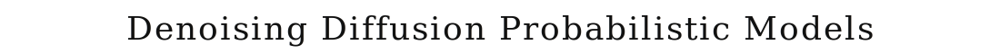
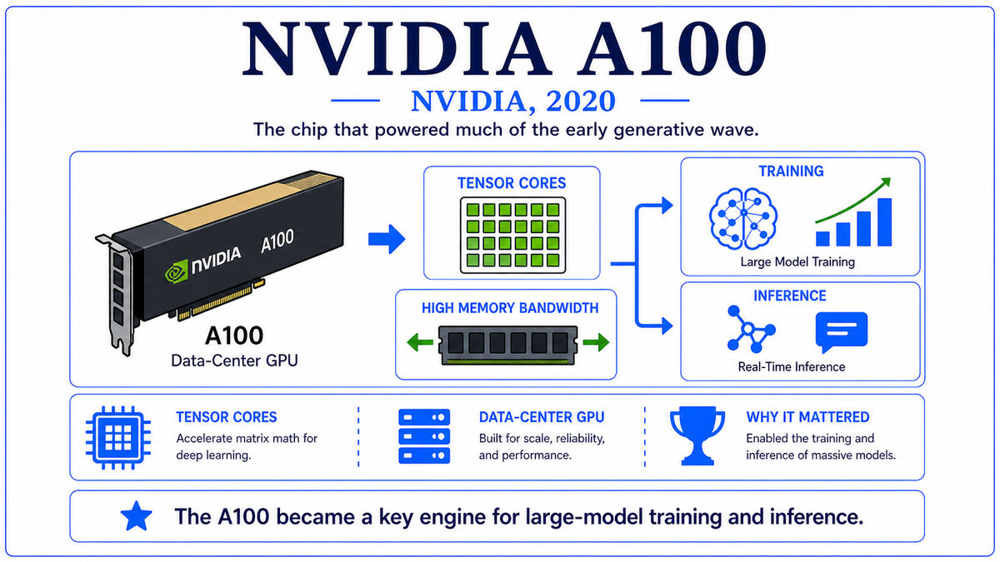

  

  <a href="https://arxiv.org/pdf/2006.11239">📄 Original Paper (NeurIPS 2020)</a> · Jonathan Ho (Born United States), Ajay Jain (Born United States), Pieter Abbeel (Born Belgium, 1977), University of California, Berkeley

<em>The dominant approach to image generation for six years had been adversarial networks. Then a Berkeley graduate student published a paper showing that adding noise to images and learning to remove it could do better.</em>

---

Generative adversarial networks had dominated image generation since Ian Goodfellow's 2014 paper. By 2020, BigGAN and StyleGAN produced photo-realistic faces, landscapes, and objects. But GANs had stubborn problems. Training was unstable, with many failure modes that required careful tuning to avoid. The generator and discriminator could end up in equilibria that produced collapsed or repetitive outputs. Sample diversity was limited compared to the data distribution. The math of GANs, expressed as a two-player minimax game, was conceptually elegant but practically painful to optimize.

A separate research thread had been quietly developing for several years. In 2015, Jascha Sohl-Dickstein and colleagues at Stanford had published a paper titled "Deep Unsupervised Learning using Nonequilibrium Thermodynamics." The idea was to define a stochastic forward process that gradually destroys structure in data by adding Gaussian noise over many small steps, eventually producing pure noise. A neural network would then learn to invert that process step by step, generating data by progressively removing noise from a Gaussian sample. The framework had clean mathematics rooted in physics and variational inference. But the early diffusion models did not produce sample quality competitive with GANs. The approach was treated as a curiosity for several years.

In Pieter Abbeel's lab at UC Berkeley, a graduate student named Jonathan Ho had been working on improving diffusion models since 2019. Abbeel, born in Belgium in 1977, was a roboticist and reinforcement learning researcher who had been a student of Andrew Ng at Stanford and had joined Berkeley in 2008. Ho was finishing his PhD with him. Working with Ajay Jain, also a Berkeley student, the team made a series of careful engineering choices that would prove decisive. They reparameterized the model to predict the noise added at each step rather than the denoised data itself. They simplified the training objective to a straightforward weighted mean-squared error. They used a U-Net architecture with timestep embeddings, attention layers, and skip connections. They tuned the noise schedule to a linear or cosine pattern.

The result, when run on standard image generation benchmarks, was striking. On CIFAR-10, the team achieved an Inception Score of 9.46 and a Fr&#233;chet Inception Distance of 3.17, beating the prior state-of-the-art GAN by significant margins. On 256-by-256 LSUN bedrooms and churches, the samples were comparable to or better than BigGAN. The training was stable. There was no minimax game, no discriminator to balance, no mode collapse. The model just optimized a simple loss and produced high-quality samples.

The paper was titled "Denoising Diffusion Probabilistic Models," abbreviated DDPM. It was uploaded to arXiv on June 19, 2020, and presented at NeurIPS in December 2020. Within months, dozens of follow-up papers had built on the technique. Within a year, diffusion had displaced GANs as the dominant paradigm for image generation. Within two years, every major commercial image generation system would be diffusion-based.

  

<em>Forward, structure becomes noise. Backward, noise becomes structure. The model learns the reverse direction.</em>

---

DDPM mattered for three reasons that recast the field of image generation.

First, it produced state-of-the-art image quality with a stable, simple training procedure. GANs had required careful tuning, balanced learning rates between generator and discriminator, and a long list of regularization tricks. DDPM required none of this. The training objective was a single mean-squared error loss. The loss curve was monotonic. There were no failure modes that researchers had to fight. For practitioners, the experience of training a diffusion model was qualitatively different from training a GAN. It just worked. The reduction in operational difficulty mattered as much as the quality improvement.

Second, the DDPM framework opened a clean theoretical handle on generation. The connection between diffusion models and score matching, established by Song and Ermon in parallel work in 2019 and 2020, gave the field a unified perspective. Diffusion models were stochastic differential equations that moved between data and noise. The neural network approximated the score function, the gradient of the log probability density of noisy data. This perspective made it possible to design new samplers that were faster than DDPM's original 1000 steps. DDIM, introduced by Song in October 2020, reduced sampling to 50 steps with comparable quality. By 2022, fast samplers like DPM-Solver could produce samples in 10 steps or fewer.

Third, diffusion models turned out to scale and generalize beautifully. Where GANs struggled to model very large or very diverse datasets, diffusion models did not. Conditional diffusion let the same model handle different generation targets by adding conditioning inputs. Text-to-image generation, when it arrived in 2021 and 2022, would use diffusion as its backbone. Audio generation, video generation, and 3D generation all converged on diffusion-based approaches within a few years. The generality of the framework, more than the specific results in the 2020 paper, is what made it a foundational moment.

---

The defining concept of diffusion models is the gradual destruction and reconstruction of structure. A forward process slowly adds Gaussian noise to a data point over many small steps. After enough steps, the data has been completely replaced by noise. A reverse process learns to take a noise sample and slowly remove the noise, step by step, recovering a sample that looks like data.

The forward process is fixed and requires no learning. Given a data point x_0, the model produces a sequence x_1, x_2, through x_T, with each step adding a small amount of Gaussian noise according to a predetermined noise schedule. By the final step T, typically 1000 in the original DDPM, the sample x_T is indistinguishable from pure Gaussian noise. The forward process can be sampled at any intermediate timestep t with a closed-form expression, which makes training efficient.

The reverse process is what the network learns. To go from noise x_T back to data x_0, the model must learn to remove the noise added at each step. Specifically, at each timestep t, given the noisy sample x_t, the model predicts the noise that was added during the forward process from x_{t-1} to x_t. Subtracting that predicted noise produces an estimate of x_{t-1}. Repeating this from t equals T down to t equals 1 produces a generated sample.

The training procedure is correspondingly simple. For each training example, sample a random timestep t uniformly between 1 and T. Compute x_t by adding the appropriate amount of noise to the data x_0. Pass x_t and t into the network and ask it to predict the noise. Compute the mean-squared error between the predicted and actual noise. Backpropagate. The objective is a single loss term and there are no adversarial dynamics. Training behaves like ordinary supervised learning.

The trade-off is sampling cost. To generate a sample, the network must be evaluated T times, once per denoising step. For DDPM with T equals 1000, this was slow. Subsequent work reduced this dramatically. DDIM showed that a deterministic sampler could produce comparable quality in 50 steps. Later samplers reduced it further. The cost of sampling has become a primary research target in diffusion models, and modern samplers can produce a high-quality image in 10 to 25 steps.

---

The forward diffusion process is defined by a Markov chain that gradually adds Gaussian noise according to a variance schedule beta_1 through beta_T. The transition at each step is q(x_t given x_{t-1}) equals N(x_t; the square root of (1 minus beta_t) times x_{t-1}, beta_t times the identity). After many steps, the marginal q(x_T) approaches a standard Gaussian distribution. By telescoping the chain, the marginal at any timestep t can be written in closed form as q(x_t given x_0) equals N(x_t; the square root of alpha_bar_t times x_0, (1 minus alpha_bar_t) times the identity), where alpha_bar_t is the cumulative product of (1 minus beta_s) up to t.

The reverse process is parameterized as p_theta(x_{t-1} given x_t) equals N(x_{t-1}; mu_theta(x_t, t), sigma_t squared times the identity). The network produces the mean of the reverse transition. The variance is typically fixed to a known function of the noise schedule rather than learned.

The loss function in DDPM is derived as a variational lower bound on the data log-likelihood, but Ho and colleagues showed that a much simpler reweighted loss works better in practice. The simplified loss, called L_simple, asks the network to predict the noise that was added during the forward process. Specifically, given a clean data point x_0 and a random timestep t, the network sees the noisy x_t and a timestep embedding, and is trained to minimize the squared error between its predicted noise epsilon_theta(x_t, t) and the actual sampled noise epsilon. This is a single line of pseudocode at training time.

The U-Net architecture used in DDPM is a convolutional encoder-decoder with skip connections at each spatial resolution. Time information enters through a sinusoidal embedding of the timestep, projected and added to feature maps at each block. Self-attention layers are inserted at low spatial resolutions to capture global structure. The base DDPM model for CIFAR-10 has about 35 million parameters. Larger versions for high-resolution image datasets scale to several hundred million.

---

The aftermath of DDPM was rapid. Within months, several groups published improvements. Improved DDPM tightened the noise schedule. Classifier-free guidance, by Ho and Tim Salimans in 2021, gave a clean way to trade off sample diversity for adherence to conditioning, and became the standard technique for conditional diffusion. DDIM and other fast samplers reduced sampling cost. By the end of 2021, diffusion models had displaced GANs as the dominant approach to high-quality image generation in research, even before the public was aware of the shift.

The most consequential application would come in text-to-image generation. Generating images from text descriptions had been a holy grail since the earliest days of generative models. Earlier attempts, using GANs or autoregressive models, had produced limited results. The combination of diffusion's quality with a way to condition on text would change everything. The conditioning piece, importantly, was being worked out in parallel by a different team, at OpenAI, who had been thinking about how to learn unified representations of images and text.

On January 5, 2021, six months after DDPM, OpenAI would announce two papers on the same day. One was a contrastive learning system that aligned image and text in a shared embedding space. The other was a text-to-image generation system. The first paper would become the conceptual workhorse of multimodal AI. The second would announce that text-to-image was possible, even if the technical approach in that initial system would soon be replaced by diffusion.

---

  <a href="2020c-NVIDIA-A100.md">← Previous: NVIDIA A100 2020</a> &nbsp;·&nbsp; <a href="2021-Ramesh-DALL-E.md">Next: DALL-E 2021 →</a>

