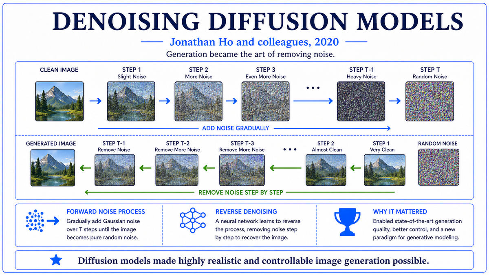

  

  <a href="https://arxiv.org/pdf/2102.12092">📄 Original Paper (DALL-E, ICML 2021)</a> · Aditya Ramesh (Born India), Mikhail Pavlov, Gabriel Goh, Scott Gray, Chelsea Voss, Alec Radford (Born United States), Mark Chen, Ilya Sutskever (Born Nizhny Novgorod, Russia, 1986), OpenAI

<em>On January 5, 2021, OpenAI released two papers on the same day. One taught a model to match images with their descriptions. The other taught a model to draw from descriptions. Together they began the era of generative multimodal AI.</em>

---

After GPT-3 had shown that scaling autoregressive transformers on web text produced surprising capabilities, OpenAI's natural next question was whether the same recipe would work across modalities. The team that worked on the answer included Aditya Ramesh, born in India, who had worked on generative modeling since joining the lab. Alec Radford, who had led GPT-2, was also involved, along with Mark Chen, Ilya Sutskever, and several others. Two parallel projects emerged from this effort, and on January 5, 2021, OpenAI released the results of both on the same day.

The first project was CLIP, which stood for Contrastive Language-Image Pre-training. The lead author was Alec Radford. The idea was simple. Collect 400 million image-text pairs from the public web. Train two encoders, one for images and one for text, so that matching pairs land close to each other in a shared embedding space and non-matching pairs land far apart. The contrastive objective was applied across each minibatch of pairs. After training on 400 million examples, CLIP had learned a remarkably general alignment between visual content and natural language. It could classify images zero-shot by computing the similarity between the image embedding and a set of text embeddings of candidate class names. On ImageNet, this zero-shot procedure matched the accuracy of a fully supervised ResNet-50, with no ImageNet labels ever seen during training.

The second project was DALL-E, named in homage to the surrealist Salvador Dal&#237; and the Pixar character WALL-E. The lead author was Aditya Ramesh. The architecture was simple in concept. Train a discrete variational autoencoder that compressed a 256-by-256 image into a grid of 32-by-32 discrete tokens drawn from a vocabulary of 8,192 codes. Concatenate text tokens with image tokens in a single sequence. Train a 12-billion-parameter autoregressive transformer to predict the next token. At generation time, condition on text tokens and sample image tokens autoregressively, then decode through the VAE. The training corpus was 250 million image-text pairs from the public web.

The DALL-E paper was titled "Zero-Shot Text-to-Image Generation," and the demonstrations were unlike anything the public had seen. The model could draw an armchair in the shape of an avocado, a baby radish in a tutu walking a dog, a snail made of harp. The compositions were creative and combinatorial. The model had not seen these specific concepts together but could combine them in plausible ways. Quality was inconsistent and resolution was limited, but the demonstrations established that text-to-image generation was possible at scale and could produce genuinely creative outputs.

Of the two papers, CLIP turned out to be more architecturally consequential. DALL-E 1's autoregressive approach over discrete codes was elegant but soon superseded by diffusion. CLIP, by contrast, became the standard tool for connecting language to vision in nearly every text-to-image system that followed, and the foundation of image search, image classification, and dozens of other multimodal applications. The two papers released on the same day had different fates. DALL-E announced that the field had arrived. CLIP became the foundation everyone built on.

  

<em>Two complementary papers, same day. Match images to text. Generate images from text. Together, the foundation of multimodal generative AI.</em>

---

The CLIP and DALL-E announcements mattered for three reasons that compounded over the following years.

First, CLIP became the substrate of multimodal AI. The shared embedding space it produced for images and text turned out to be extraordinarily useful as a building block. Later text-to-image systems used the CLIP text encoder as their conditioning input. Image search systems used CLIP embeddings to find images by description. Image classification and zero-shot vision tasks used CLIP without any task-specific training. By 2023, CLIP and its successors were embedded in essentially every product that needed to connect language and images. Few papers in the history of deep learning have had a comparable footprint. The contrastive recipe also generalized to other modality pairs, with CLIP-style methods applied to audio-text, video-text, and 3D-text alignment.

Second, DALL-E demonstrated that text-to-image generation was a real capability and not just a research curiosity. The compositional creativity of the early demonstrations established the possibility space. Researchers and the public began to see text-to-image generation as a category that would matter, even though the specific architecture would change. The race to build better text-to-image systems began in earnest in 2021 and produced a flood of work over the next two years. GLIDE in late 2021, DALL-E 2 in April 2022, Imagen in May 2022, Parti, Make-A-Scene, and others all followed in rapid succession.

Third, the simultaneous release of two complementary papers from the same lab established a pattern for how ambitious AI research would now be packaged. Each paper alone was strong. Together, they made a coherent statement about the direction of the field. OpenAI's release strategy, releasing CLIP weights openly while keeping DALL-E behind a research API, also reflected the increasingly explicit policy choices that AI labs were now making about which capabilities to share with whom.

---

The defining concept across the two papers is that vision and language can share a representation space, and that scale plus the right objective produces useful alignment between them.

CLIP's central idea is contrastive learning at scale. The image encoder and text encoder each map their input to a fixed-dimensional embedding vector. The contrastive loss is computed on minibatches of image-text pairs. For a batch of N pairs, the model computes an N-by-N similarity matrix between every image embedding and every text embedding. The loss encourages matching pairs (the diagonal) to have high similarity and mismatched pairs (off-diagonal) to have low similarity, applied symmetrically to both image-to-text and text-to-image retrieval. This simple objective, applied to 400 million pairs scraped from the web, produces an alignment that generalizes to a remarkably wide range of downstream tasks.

DALL-E's central idea is treating image generation as autoregressive sequence modeling, the same template that worked for language. The trick is the discrete VAE that turns a continuous image into a sequence of discrete tokens. Once the image has been tokenized, generation can be performed by a standard autoregressive transformer. The transformer sees text tokens followed by image tokens, and at generation time the user provides the text and the model generates the image tokens one at a time. The discrete VAE is trained separately. It compresses 256-by-256 images into 32-by-32 grids of tokens with 8,192 possible values per position. The compression rate is high enough to make the autoregressive sequence tractable, and the reconstruction quality is good enough that the decoded image preserves the semantics of the original.

The conceptual link between the two papers is that both treat language as the universal interface to other modalities. CLIP uses language as the supervision signal for learning visual representations. DALL-E uses language as the conditioning input for generating images. In both cases, the structure of natural language carries the burden of specifying what the model should do. The recipe of language-as-interface, established in these two papers, has been the dominant pattern in multimodal AI ever since.

---

CLIP's training objective is the symmetric cross-entropy contrastive loss. For a batch of N image-text pairs, the model computes image embeddings I_1 through I_N and text embeddings T_1 through T_N, normalized to unit norm. The similarity matrix S has entries S_ij equal to the cosine similarity between I_i and T_j, scaled by a learnable temperature parameter. The image-to-text loss is the cross-entropy of softmax over rows of S with the diagonal as targets. The text-to-image loss is the same with columns instead of rows. The total loss is the average of these two terms. CLIP was trained at multiple scales, with the largest version using a Vision Transformer backbone for the image encoder and a Transformer for the text encoder, totaling several hundred million parameters.

DALL-E's architecture has two stages. The discrete VAE encoder maps an image x of size 256 by 256 by 3 to a grid of 32 by 32 latent codes, each a categorical variable over 8,192 possibilities. The decoder reconstructs the image from the codes. Training the VAE uses a Gumbel-softmax relaxation to allow gradients to flow through the discrete bottleneck. The transformer is a 12-billion-parameter decoder-only model with sparse attention patterns. It operates on sequences of up to 1,280 tokens, consisting of up to 256 BPE-tokenized text tokens followed by 1,024 image codes. Training is autoregressive, with the standard next-token prediction objective applied across the joint sequence.

At generation time, a text prompt is BPE-tokenized and fed as the first part of the sequence. The transformer samples 1,024 image codes autoregressively. CLIP is used at generation time to rerank multiple samples by their similarity to the input text, an early demonstration of how the two systems would be used together.

---

The follow-up work was rapid and ambitious. Within a year, the field had largely moved away from DALL-E 1's autoregressive approach toward diffusion-based text-to-image generation. GLIDE from OpenAI in December 2021 used classifier-free guided diffusion. DALL-E 2 in April 2022 combined a CLIP-conditioned prior with a diffusion decoder. Imagen from Google Brain in May 2022 used a frozen large language model as text encoder with a cascade of diffusion models. All of these systems shared two architectural pieces. They used text encoders related to CLIP's, often CLIP itself. They used diffusion as the generative process. The DDPM paper from June 2020 had supplied the generative engine. The CLIP paper from January 2021 had supplied the language conditioning. Combined, they were the foundation of modern text-to-image generation.

But all of these systems remained closed. DALL-E 2 was an OpenAI API. Imagen was never released to the public. The compute required to train and run them was substantial, on the order of hundreds of A100 GPU-days. The quality was high but the access was gated. The research community wanted an open alternative.

In Munich, a small academic group at Ludwig Maximilian University had been working on the efficiency problem. Their insight was that diffusion did not need to operate at full image resolution. If you first compressed the image into a much smaller latent representation, then ran diffusion in that compressed space, then decoded back to pixels, you could get the same quality at a fraction of the compute cost. The technique was called latent diffusion. By the summer of 2022, with funding from a startup called Stability AI, they would release the weights publicly under a permissive license. The model was called Stable Diffusion, and it changed who could participate in the generative AI moment.

---

  <a href="2020d-Ho-DDPM.md">← Previous: DDPM 2020</a> &nbsp;·&nbsp; <a href="2022a-Rombach-Stable-Diffusion.md">Next: Stable Diffusion 2022 →</a>

