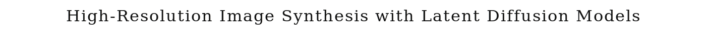
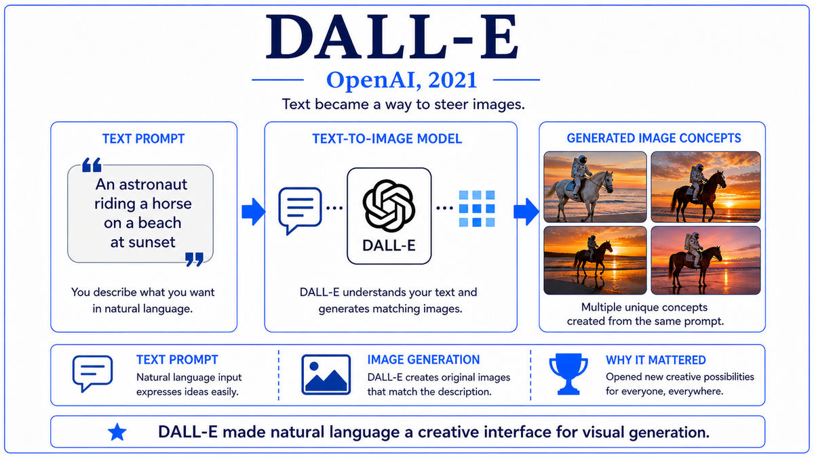

  

  <a href="https://arxiv.org/pdf/2112.10752">📄 Original Paper (CVPR 2022)</a> · Robin Rombach (Born Germany), Andreas Blattmann (Born Germany), Dominik Lorenz (Born Germany), Patrick Esser (Born Germany), Bj&#246;rn Ommer (Born Germany), CompVis Group, Ludwig Maximilian University of Munich

<em>A small academic group in Munich figured out how to do diffusion 64 times more efficiently. A startup called Stability AI gave them the compute. On August 22, 2022, they released the model weights publicly. The open-source AI moment had begun.</em>

---

By late 2021, diffusion-based text-to-image systems were producing extraordinary quality. The problem was that almost no one outside a handful of well-funded labs could run them. DALL-E 2, Imagen, and GLIDE all required enormous compute to train and substantial compute to generate each image. Their weights were not released. To use them, you had to wait for an API invitation from a closed beta. The research community was watching the most exciting development in years happen behind glass.

A research group at Ludwig Maximilian University of Munich had been working on the efficiency problem. The CompVis group was led by Bj&#246;rn Ommer, born in Germany, a professor whose lab focused on computer vision and generative models. The team that produced the breakthrough included Robin Rombach, the lead author and a doctoral student in the lab, along with Andreas Blattmann, Dominik Lorenz, and Patrick Esser. All five authors were born in Germany. They were not a frontier-scale lab. They had limited GPU resources. The constraint forced them to think hard about where the compute in diffusion was actually being spent.

Their answer was that diffusion did not need to operate in pixel space. A typical text-to-image diffusion model in 2021 ran a U-Net at full image resolution at every denoising step, often a few hundred steps per generated image. For a 512-by-512 RGB image, the U-Net was processing 786,432-dimensional inputs hundreds of times per generation. Most of this compute, the team reasoned, was spent on perceptually irrelevant detail. If they could compress the image into a much smaller latent representation that preserved the perceptually important content but discarded the high-frequency texture, they could run diffusion in that compressed space at a small fraction of the cost.

The architecture they built had two stages. First, an autoencoder was trained to compress 512-by-512 images into 64-by-64-by-4 latent representations and back. The autoencoder used a combination of pixel reconstruction loss, a perceptual loss based on a pretrained VGG network, and an adversarial loss to maintain texture quality. The compression was about 48 to 1 in spatial dimensions, but the latent space preserved enough information for visually faithful reconstructions. Second, a U-Net diffusion model was trained in this latent space rather than in pixel space. Text conditioning was injected through cross-attention layers, with text embeddings produced by a frozen CLIP text encoder. At generation time, the U-Net produced latents from noise conditioned on text, and the autoencoder decoder turned the latents into pixels.

The paper, titled "High-Resolution Image Synthesis with Latent Diffusion Models," was uploaded to arXiv in December 2021 and presented at CVPR in June 2022. The training cost for a state-of-the-art text-to-image model dropped from hundreds of A100 GPU-days for pixel-space diffusion to tens of A100 GPU-days for latent diffusion. The inference cost dropped enough that high-quality samples could be produced on a single consumer GPU in seconds. The compute pressure that had kept text-to-image models confined to large labs was suddenly gone.

The story of how this technology became public is part of the chapter. Stability AI, a London-based startup founded by Emad Mostaque, provided the compute to scale up the latent diffusion model on the LAION-5B dataset of 5.85 billion image-text pairs. After several months of training on A100 clusters, the resulting model was named Stable Diffusion. On August 22, 2022, Stability AI released the model weights publicly under a permissive license. Anyone could download them. Anyone could run the model on their own hardware. The open-source AI moment that had been brewing in language models had now arrived for image generation.

  

<em>Compress to a latent. Diffuse in the latent. Decode to pixels. The trick that put diffusion on a laptop.</em>

---

Stable Diffusion mattered for three reasons that compounded into a cultural moment.

First, it democratized text-to-image generation. Before August 2022, generating images from text required access to a closed API at OpenAI or a research collaboration with Google. After August 2022, anyone with a 10-gigabyte GPU could generate images at home. Within weeks, dozens of front-end interfaces appeared. The Automatic1111 web UI made the model accessible to non-programmers. Discord servers hosting Stable Diffusion bots accumulated millions of users. The shift from gated research to ubiquitous deployment happened in months, not years.

Second, the open weights enabled an ecosystem of derivative work that closed models had not. Researchers fine-tuned Stable Diffusion on specific styles, characters, and use cases, sharing the resulting LoRAs and checkpoints on community sites like CivitAI and Hugging Face. ControlNet, released in February 2023, added precise spatial control over generation by conditioning on edge maps, depth maps, or pose skeletons. AnimateDiff added video generation. DreamBooth let users teach the model to generate specific subjects from a few reference photos. None of this could have been built on a closed model. The open ecosystem produced more capability than any single closed lab could have built alone.

Third, Stable Diffusion forced the broader debate about open weights to a head. The release was controversial. Critics worried about misuse, including non-consensual imagery, misinformation, and copyright issues. Supporters argued that gatekeeping such a fundamental technology behind a few corporate APIs would be worse for the field, the public, and innovation. The arguments around Stable Diffusion's release became the template for every subsequent debate about open versus closed AI release. The controversy continues to shape how labs decide what to share, but the precedent that frontier-class generative AI could be released openly was set.

---

The defining concept of latent diffusion is that diffusion does not need to happen in the same space as the data. By moving the diffusion process to a compressed latent representation, you can preserve the perceptually important content of the data while paying a fraction of the compute cost.

The autoencoder is the bridge. It is trained, separately and once, to compress images into latents and decode them back. The compression is lossy in pixel space but is designed to be visually faithful. Practical autoencoders for latent diffusion use a combination of reconstruction loss, perceptual loss based on features from a pretrained recognition network, and adversarial loss to maintain sharpness. The result is a latent space where simple Euclidean operations correspond approximately to perceptually meaningful transformations of the underlying image.

Diffusion in the latent space then proceeds exactly as in pixel-space diffusion. A forward process gradually adds Gaussian noise to the latent representation. A reverse U-Net is trained to denoise. The U-Net is much smaller than a pixel-space U-Net for the same image resolution because the spatial dimensions of the latent are much smaller. The convolutional structure still works because the latent space preserves spatial structure, with each latent position roughly corresponding to a small patch of the original image.

Text conditioning enters through cross-attention. At each U-Net block, the latent feature maps query a text encoder's output. The text encoder is typically a frozen CLIP text encoder, providing rich language representations without any additional training. The cross-attention mechanism lets each spatial location in the latent attend to the text tokens, pulling in semantic information about what should appear there. The conceptual lesson generalizes beyond images. Modern video generation systems like Sora extend the same compress-then-diffuse principle to space-time latents.

---

The autoencoder is a convolutional encoder E and decoder D, with E mapping images x of shape 512 by 512 by 3 to latents z of shape 64 by 64 by 4, an 8x downsampling per spatial dimension. The autoencoder is trained with a combined loss including pixel-space reconstruction, an LPIPS perceptual loss using VGG features, an adversarial loss from a discriminator, and a small KL regularization on the latent distribution.

The U-Net diffusion model is trained on the latent space with the standard DDPM noise-prediction objective. Cross-attention layers replace some of the self-attention layers, with the U-Net activations as queries and a text encoder's output as keys and values. The text encoder for the original Stable Diffusion was a frozen CLIP ViT-L/14, producing 77 by 768 contextualized token embeddings.

The base Stable Diffusion v1 model has approximately 890 million parameters in the U-Net plus the autoencoder and text encoder. Training used the LAION-5B dataset of 5.85 billion image-text pairs, filtered for quality and aesthetic score. Training ran on a Stability AI cluster of 256 A100 GPUs for several weeks. Inference uses a DDIM or DPM-Solver sampler for 25 to 50 denoising steps, producing a sample in a few seconds on a consumer-grade GPU.

Classifier-free guidance, the technique introduced by Ho and Salimans in 2021, is applied at inference time. The model is trained both with and without text conditioning, and at sampling time the guidance scale parameter trades off diversity against text adherence. Higher guidance scales produce samples that more strictly follow the prompt at the cost of diversity and naturalness.

---

The release of Stable Diffusion on August 22, 2022, became a watershed for open-source AI. Within a month, more than 200,000 people had downloaded the weights. Within six months, the model had been incorporated into commercial products, hobbyist tools, and academic research across the world. Stable Diffusion v1.5, v2.0, SDXL, and SD3 each pushed quality forward over the next two years. The third-party ecosystem of fine-tunes, extensions, and creative applications grew faster than the official releases. CivitAI accumulated tens of thousands of community models. Hugging Face hosted millions of users running open generative AI.

The cultural impact was as significant as the technical one. Within months of the release, debates about copyright, artist consent, training data, and the future of creative work were happening in mainstream media. Lawsuits were filed. Commercial vendors took different stances. The discussion of how generative AI should integrate with creative industries, started by Stable Diffusion, has only grown more important.

Three months after Stable Diffusion's release, on November 30, 2022, OpenAI would release a different kind of generative AI moment. They had been quietly applying reinforcement learning from human feedback to a fine-tuned version of GPT-3.5, training it to follow instructions and have natural conversations. The result was a chat interface to a large language model. Few people inside OpenAI thought it would be a major launch. Within five days of release, it had a million users. Within two months, it had a hundred million. Stable Diffusion had brought generative AI to the public in images. ChatGPT was about to do the same in language, and at a scale that would dwarf everything that had come before.

---

  <a href="2021-Ramesh-DALL-E.md">← Previous: DALL-E 2021</a> &nbsp;·&nbsp; <a href="2022b-OpenAI-ChatGPT.md">Next: ChatGPT 2022 →</a>

