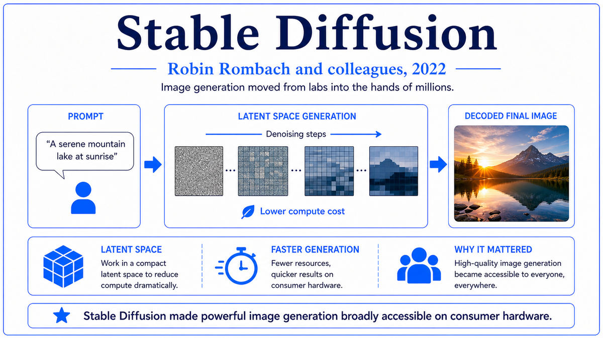

  

  <a href="https://openai.com/index/chatgpt/">📄 Product Announcement (OpenAI, November 2022)</a> · Long Ouyang and the InstructGPT team, John Schulman (Born United States, 1985), Sam Altman (Born St. Louis, Missouri, United States, 1985), Greg Brockman (Born North Dakota, United States, 1987), and the OpenAI ChatGPT team

<em>OpenAI launched a free preview of a chat interface to a fine-tuned language model on a Wednesday afternoon. Within five days it had a million users. Within two months, a hundred million. Generative AI had gone mainstream, and nothing in the field would be quiet again.</em>

---

By early 2022, OpenAI had a problem. GPT-3 was extremely capable, accessible through an API, and useful for many specific tasks if a developer was willing to write good prompts. But raw GPT-3 was an awkward conversational partner. It would happily produce confident misinformation. It would not refuse harmful requests. It often did not follow instructions well. Asked to summarize an article, it might continue the article. Asked a factual question, it might answer plausibly but wrongly. The base language modeling objective rewarded predicting the next token in web text, not being helpful.

The technical answer to this problem had been developed inside OpenAI over the preceding two years. The lead researcher was Long Ouyang, who had joined OpenAI from a postdoc at Stanford. The technique was reinforcement learning from human feedback, abbreviated RLHF. The basic idea had been explored by Paul Christiano and others at OpenAI as early as 2017 in the context of robotics and game-playing. The application to language models was new. In March 2022, Ouyang and colleagues published a paper titled "Training language models to follow instructions with human feedback." It was the InstructGPT paper. It described a three-stage training pipeline that turned a raw GPT-3 into a much more useful instruction-following model.

The pipeline ran in three stages. First, supervised fine-tuning on roughly 13,000 demonstrations written by human contractors. The contractors were given prompts and wrote good responses, and the model was fine-tuned to mimic them. Second, training a reward model. Contractors were shown several model completions for each prompt and ranked them by quality. Roughly 33,000 such ranking comparisons were collected, and a reward model was trained to predict the human rankings. Third, reinforcement learning. The fine-tuned language model was further optimized by Proximal Policy Optimization, a reinforcement learning algorithm that John Schulman, born in the United States in 1985 and an OpenAI co-founder, had developed in 2017. The reward signal came from the trained reward model. A KL penalty kept the new model close to the original supervised one to prevent the RL training from finding adversarial loopholes.

The result was a language model that followed instructions, refused harmful requests, and produced more useful responses with much less prompt engineering. The 1.3 billion parameter InstructGPT was preferred to the 175 billion parameter raw GPT-3 by human evaluators. RLHF had effectively bought a hundred-fold increase in apparent capability for a fraction of the compute it would have taken to scale.

ChatGPT was the application of this recipe to conversation. The base model was a fine-tuned variant of GPT-3.5, OpenAI's interim model between GPT-3 and GPT-4. The team wrapped it in a chat interface, with a multi-turn conversation history, system prompts, and the ability to ask follow-up questions. The product was launched on November 30, 2022, as a free research preview. The team's expectations had been modest. Sam Altman, OpenAI's CEO, born in St. Louis, Missouri, in 1985, posted on Twitter that they wanted feedback. The internal expectation was tens of thousands of users in the first month.

Within five days the user count had passed one million. Within two months, in late January 2023, it had passed one hundred million. ChatGPT became the fastest-growing consumer product in history, faster than TikTok, faster than Instagram, faster than the iPhone. The chat interface, more than any specific technical feat, had unlocked something. Anyone who could type a question could now talk to a frontier AI system.

  

<em>Demonstrations, then preferences, then optimization. The recipe that turned a raw language model into a useful assistant.</em>

---

ChatGPT mattered for three reasons that reshaped the technology industry within months.

First, it brought generative AI to mass public awareness for the first time. Before November 2022, generative AI was a category that developers and researchers knew about but the general public did not. After November 2022, generative AI was a household phrase. A hundred million users in two months exceeded by an order of magnitude what any prior AI product had achieved. Schools struggled with how to handle student use of ChatGPT. Lawyers, doctors, and software engineers integrated it into their daily work. The cultural transition from "AI is a research field" to "AI is a tool I use" happened in weeks, not years.

Second, it triggered a competitive race that would define the next several years of the field. Within weeks of ChatGPT's launch, Google declared an internal "code red" and accelerated its own LLM products. Microsoft invested ten billion dollars in OpenAI in January 2023 and began integrating GPT into its products as Bing Chat, Copilot, and Office integrations. Anthropic, founded by former OpenAI researchers, accelerated work on Claude. Meta accelerated work on Llama. Every major technology company had to have an answer to ChatGPT, and the answers consumed billions of dollars and the attention of every major AI lab through 2023 and 2024.Third, RLHF as a technique was validated as the alignment recipe of the era. Before ChatGPT, RLHF was a published technique that some researchers found promising. After ChatGPT, RLHF was the standard. Every major frontier model that followed used some form of human or AI feedback fine-tuning to make the base language model usable. Variants emerged. Constitutional AI from Anthropic substituted AI feedback for human feedback in many places. Direct Preference Optimization simplified the math. But the core idea, that language models needed to be aligned with human preferences after pretraining to be genuinely useful, became universal.

---

The defining concept of ChatGPT is reinforcement learning from human feedback as the bridge between raw language model capability and usable product. A raw language model trained on web text knows a great deal but has no incentive to be helpful, honest, or safe. It is optimized to predict next tokens. RLHF reshapes its outputs by introducing human judgment as the optimization target.

The three-stage pipeline operationalizes this. The first stage, supervised fine-tuning, gives the model a starting point of behaviorally appropriate responses by training it to mimic human-written demonstrations. The second stage, reward model training, captures the much richer signal of relative quality. Humans are better at comparing two responses than at writing perfect ones, so preference comparisons scale better than demonstrations. The reward model learns to mimic these comparative judgments. The third stage, reinforcement learning, optimizes the language model against the reward model. The KL penalty against the SFT model prevents the optimizer from finding strategies that the reward model rates highly but humans would not endorse.

The chat interface itself was the second key concept. Wrapping a language model in a conversational UI was not technically deep, but it was a UX innovation that mattered. Multi-turn conversations let users iterate, clarify, and correct. System prompts let the model adopt personas. The human-on-the-other-side framing made AI feel approachable in ways that an API call did not. A great deal of ChatGPT's mass appeal came from the chat metaphor itself, not just the underlying model.

The implicit third concept was that helpfulness, harmlessness, and honesty are competing objectives that need to be balanced. A perfectly helpful model would never refuse anything, including dangerous requests. A perfectly safe model would refuse most things and be useless. RLHF gave a knob, the human feedback signal, with which these tradeoffs could be tuned. The choice of where to set the knob became one of the most important and most debated decisions in AI product design.

---

The InstructGPT pipeline can be written in three steps. First, supervised fine-tuning. Given a dataset of prompts and demonstrations (x_i, y_i), train the language model to maximize the conditional log-likelihood of demonstrations given prompts. This produces the SFT model pi_SFT.

Second, train the reward model r_phi. Given a dataset of prompts with preference comparisons (x, y_w, y_l) where y_w is preferred over y_l, the reward model is trained with a Bradley-Terry preference loss. The probability that y_w is preferred is sigma(r_phi(x, y_w) minus r_phi(x, y_l)), where sigma is the logistic function. The reward model is itself a transformer, often initialized from the SFT model with a final scalar head replacing the language modeling head.

Third, reinforcement learning. The objective is to maximize expected reward subject to a KL penalty against the SFT distribution. Specifically, the objective is the expectation over prompts and model samples of r_phi(x, y) minus beta times the KL divergence between the policy pi_theta and pi_SFT. The KL penalty prevents the policy from drifting into regions where the reward model is unreliable. PPO is used as the optimizer, with the reward signal coming from the reward model and the KL penalty acting as a regularizer.

ChatGPT specifically used GPT-3.5 as its base model. Architectural details have not been publicly disclosed in full, but the model is approximately 175 billion parameters in the standard decoder-only transformer pattern. The fine-tuning data for ChatGPT was larger and more conversation-focused than InstructGPT's, and additional safety-focused fine-tuning rounds were applied. The product launched with the full pipeline already complete and an inference infrastructure capable of serving millions of users at low latency.

---

The aftermath of ChatGPT's release reshaped the technology industry. Microsoft's ten billion dollar investment in January 2023 was the most consequential single deal in AI history. By February 2023, Microsoft had integrated GPT-4 preview into Bing Chat. Google declared an internal code red and launched Bard within weeks, then Gemini in late 2023. The race to build, deploy, and improve large language models consumed every major lab's attention through 2023 and beyond.

The hardware demand exploded with the software demand. Training and serving frontier models required enormous A100 deployments. NVIDIA's data center revenue grew from a few billion dollars per quarter to twenty billion dollars per quarter over the following two years. The waiting list for GPU allocation became a strategic asset. Every cloud provider raced to expand AI infrastructure.

But NVIDIA had been preparing the next generation chip even before ChatGPT launched. At GTC in March 2022, NVIDIA had announced the Hopper architecture and the H100 GPU. The chip was designed specifically for the workloads that transformer-based AI was producing, with new precision formats, new interconnect, and a feature called the Transformer Engine that automatically chose between FP8 and FP16 per layer. The H100 became generally available in late 2022, exactly as ChatGPT was triggering the race that would consume every H100 NVIDIA could ship for the next three years.

---

  <a href="2022a-Rombach-Stable-Diffusion.md">← Previous: Stable Diffusion 2022</a> &nbsp;·&nbsp; <a href="2022c-NVIDIA-H100.md">Next: NVIDIA H100 2022 →</a>

