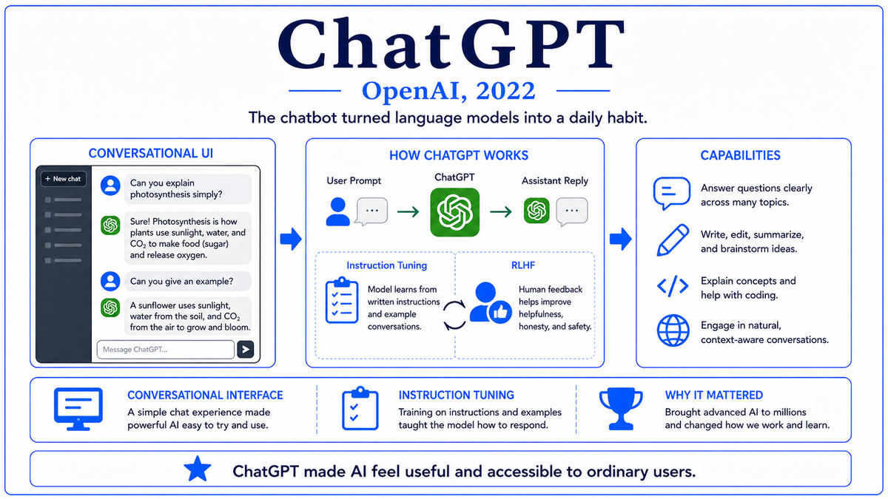

  

  <a href="https://www.nvidia.com/en-us/data-center/h100/">📄 Product Announcement (NVIDIA, March 2022)</a> · Jensen Huang (Born Tainan, Taiwan, 1963), Bill Dally (Born United States, 1960), and the NVIDIA Hopper architecture team, named after Grace Hopper (Born New York City, United States, 1906)

<em>The chip that powered every frontier model from 2023 onward. Announced months before ChatGPT, it became the scarcest and most valuable piece of silicon in the world by the time anyone realized what it would be used for.</em>

---

NVIDIA announced the Hopper architecture and the H100 GPU at the GPU Technology Conference on March 22, 2022. Eight months later, ChatGPT would launch and the demand for AI training compute would explode. The H100 had been designed and built before that explosion, but it would arrive at exactly the right time to absorb it. The chip was named after Grace Hopper, born in New York City in 1906, the United States Navy admiral and computer pioneer who had developed the first compiler in the 1950s and championed high-level programming languages throughout her career. NVIDIA had taken to naming each generation of its data center architectures after foundational figures in computing. Pascal, Volta, Turing, Ampere, Hopper. The choice of Hopper for 2022 reflected the company's view that this generation would mark the transition from hardware-as-tool to AI-as-product.

The H100 was built on TSMC's 4N process, a custom NVIDIA variant of TSMC's 4-nanometer-class node. The chip contained 80 billion transistors in a die of roughly 814 square millimeters. The compute organization was 132 streaming multiprocessors, each with 128 FP32 CUDA cores and 4 fourth-generation Tensor Cores. The Tensor Cores were the major architectural step. They added native support for two new 8-bit floating-point formats, called E4M3 and E5M2, with hardware acceleration for both training and inference. The chip integrated a feature NVIDIA called the Transformer Engine, which dynamically chose between FP8 and FP16 precision for different tensors during training, with automatic scaling to keep the optimization stable.

The throughput numbers reflected the design priorities. Per chip, the H100 delivered 67 teraFLOPS of FP32, 989 teraFLOPS of TF32 with sparsity, 1,979 teraFLOPS of BF16 and FP16 with sparsity, and up to 3,958 teraFLOPS of FP8 with sparsity. For workloads that could exploit all of FP8 sparsity, structured sparsity, and Tensor Core acceleration together, the chip delivered nearly four petaFLOPS of training compute. This was three times the A100's peak training throughput in BF16, or six times in FP8. Memory was 80 gigabytes of HBM3, the next generation of high bandwidth memory, delivering 3.35 terabytes per second of memory bandwidth, a 64 percent improvement over the A100. NVLink 4.0 connected GPUs at 900 gigabytes per second, half again faster than NVLink 3.0.

The DGX H100 system contained eight H100s and delivered 32 petaFLOPS of FP8 training performance in a single 6U chassis. The DGX SuperPod, a reference architecture for training infrastructure, scaled to 256 H100s connected by NVLink Switch System hardware, with all 256 GPUs sharing memory in a single coherent NVLink domain. For larger training runs, multiple SuperPods could be linked by InfiniBand into clusters of thousands or tens of thousands of H100s. The most ambitious training runs of 2023 and 2024 used clusters of fifty thousand or more H100s, an order of magnitude larger than anything that had been built on the A100 generation.

The H100 also introduced the Grace Hopper Superchip, a single package combining a Grace CPU with an H100 GPU connected by a 900 gigabyte per second NVLink-C2C interconnect. The Grace CPU was an NVIDIA-designed Arm-based server processor with 72 cores and 480 gigabytes of LPDDR5X memory. The combined GH200 chip targeted workloads that needed tight CPU-GPU coupling, including very large language model training and inference where the CPU side handled data preprocessing and orchestration while the GPU did the heavy lifting.

  

<em>The Transformer Engine and FP8. The chip designed for the workload that was about to take over the world.</em>

---

The H100 mattered for three reasons that defined the 2023-2025 frontier AI era.

First, it was the chip on which essentially every frontier model from 2023 onward was trained. GPT-4 used H100s. Claude 3 used H100s. Gemini Ultra used H100s. Llama 2 and Llama 3 used H100s. The post-ChatGPT explosion of frontier model training depended on H100 availability, and H100s sold as fast as TSMC and NVIDIA could ship them. By 2023, every major AI lab and every major cloud provider had multi-billion-dollar H100 procurement programs. Allocation was rationed by NVIDIA. Waiting lists stretched into 2024 and beyond. The chip became the most important physical asset in technology.

Second, the H100 validated FP8 as the new training precision. Every prior generation of NVIDIA hardware had assumed that training required FP16 or FP32. The H100 demonstrated that FP8, with appropriate per-tensor scaling and the Transformer Engine's dynamic format selection, could train large models with no measurable loss in final quality. The throughput gains from FP8 were enormous, doubling effective training capacity over BF16. Within a year, FP8 was the default training precision for new models. The lessons learned from the H100's Transformer Engine fed directly into subsequent precision research, including hardware-accelerated FP4 in the Blackwell generation that followed.

Third, the H100 made NVIDIA the most valuable company in the world. The combination of H100 demand, H100 scarcity, and H100 margins drove NVIDIA's revenue from approximately twenty-seven billion dollars in fiscal 2023 to sixty billion dollars in fiscal 2024 to one hundred and thirty billion dollars in fiscal 2025. NVIDIA's market capitalization grew from about four hundred billion dollars in late 2022 to over three trillion dollars in 2024, briefly making it the most valuable public company in the world. The H100 was the product that turned NVIDIA from a leading semiconductor company into the central infrastructure provider of the AI era.

---

The H100's defining concept is the Transformer Engine, the integration of FP8 hardware with software that automatically manages precision per tensor during transformer training. The motivation is that different tensors in a transformer have very different numerical statistics. Attention scores have small ranges. Activations from the feedforward layers can have large ranges. Weights have stable distributions. Gradients vary widely across layers and through training. A single fixed precision is suboptimal for all of these.

The Transformer Engine handles this by tracking statistics for every tensor that enters a Tensor Core operation. Before each matrix multiplication, the engine computes per-tensor scaling factors based on running statistics of the tensor's distribution. The tensor is cast to FP8 with the appropriate scale, the matrix multiply runs at FP8 throughput, and the output is upcast back to higher precision for accumulation. The two FP8 formats serve different purposes. E4M3 has 4 exponent bits and 3 mantissa bits, providing precision but limited range, suitable for forward pass tensors. E5M2 has 5 exponent bits and 2 mantissa bits, providing range but limited precision, suitable for gradients with high dynamic range during the backward pass.

The conceptual significance is that precision became dynamic and adaptive rather than fixed. A training run on the H100 could use FP8 for most matrix multiplies, FP16 or BF16 where FP8 was insufficient, and FP32 for the master weight copy and optimizer state. The mixing happened transparently, with the Transformer Engine handling the bookkeeping. The result was that researchers got the throughput benefits of low precision without having to redesign their training scripts. This was the same principle that had motivated the A100's TF32, applied at a deeper level and to much lower precisions.

The Hopper generation also added significant features beyond FP8. DPX instructions accelerated dynamic programming algorithms used in computational biology and route planning. Confidential computing extended secure enclaves to GPU workloads. The Thread Block Cluster feature in CUDA gave programmers a coarser unit of parallelism above the thread block level, useful for very large matrix multiplications. The cumulative effect was that the H100 was a more ambitious architectural step than the A100 had been over the V100.

---

The H100 chip contains 80 billion transistors built on TSMC's 4N process. It has 132 streaming multiprocessors, each with 128 FP32 CUDA cores, 64 INT32 cores, 64 FP64 cores, and 4 fourth-generation Tensor Cores. The chip runs at a base clock of 1,095 MHz with a boost clock of 1,755 MHz. Per-chip throughput in dense FP32 is 67 teraFLOPS. With Tensor Cores and structured sparsity, TF32 reaches 989 teraFLOPS, BF16 and FP16 reach 1,979 teraFLOPS, and FP8 reaches 3,958 teraFLOPS.

Memory is 80 gigabytes of HBM3 organized into five stacks. HBM3 bandwidth is 3.35 terabytes per second, more than 1.6 times the A100's HBM2e bandwidth. NVLink 4.0 provides 900 gigabytes per second of bidirectional bandwidth across 18 links per GPU. The NVLink Switch System extends NVLink across 256 GPUs in a single coherent domain. PCIe Gen5 connects to host CPUs at 128 gigabytes per second.

The DGX H100 packages eight H100 SXM modules with 640 gigabytes of HBM3 total, connected through four third-generation NVSwitch chips. The system delivers 32 petaFLOPS of FP8 sparse training performance in a 6U chassis at about 10.2 kilowatts of power consumption. The DGX SuperPod scales the same architecture to 256 GPUs in 32 chassis, sharing one coherent NVLink memory space.

The Grace Hopper Superchip combines a Grace CPU and an H100 GPU on a single package. The CPU has 72 Neoverse V2 Arm cores and 480 gigabytes of LPDDR5X. The CPU and GPU communicate through NVLink-C2C at 900 gigabytes per second, an order of magnitude faster than typical PCIe-based CPU-GPU connections. Total system power is around 1,000 watts.

---

The H100 began shipping in volume in late 2022, exactly as ChatGPT was launching the generative AI moment. By mid-2023, every major AI lab was buying H100s by the tens of thousands. OpenAI, Microsoft, Google, Meta, Amazon, Anthropic, and an increasing list of smaller labs were all on H100 procurement programs running into billions of dollars per year. Saudi Arabia, the United Arab Emirates, and other states began acquiring H100 clusters as national infrastructure investments. Export controls from the United States restricted H100 sales to China, leading NVIDIA to design downgraded H800 and H20 variants for the Chinese market.

The H100 also enabled a specific kind of model that the A100 had not. The most consequential frontier release of 2023 was OpenAI's GPT-4, which had been in development since the GPT-3 release and had benefited from H100 training. The model was multimodal, accepting both text and images. It was significantly stronger than GPT-3.5 across nearly every benchmark. The OpenAI technical report published with GPT-4 was famously sparse on architecture details, citing competitive and safety reasons. But the model was on the H100, and the H100 was about to make 2023 the most consequential year for frontier AI in history.

---

  <a href="2022b-OpenAI-ChatGPT.md">← Previous: ChatGPT 2022</a> &nbsp;·&nbsp; <a href="2023a-OpenAI-GPT-4.md">Next: GPT-4 2023 →</a>

