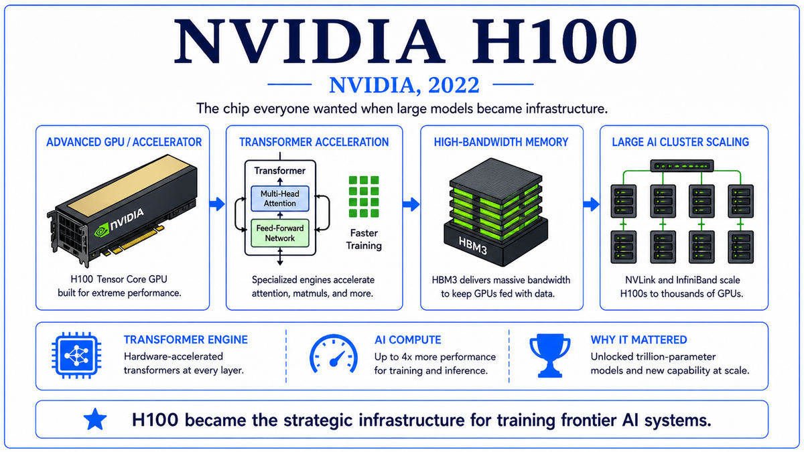

  

  <a href="https://arxiv.org/pdf/2303.08774">📄 Original Paper (OpenAI Technical Report, March 2023)</a> · OpenAI, with leadership from Sam Altman (Born St. Louis, Missouri, United States, 1985), Greg Brockman (Born North Dakota, United States, 1987), Ilya Sutskever (Born Nizhny Novgorod, Russia, 1986), Mira Murati (Born Vlor&#235;, Albania, 1988)

<em>Three and a half months after ChatGPT, OpenAI released the model that had been quietly powering it from the start. GPT-4 was multimodal, much more capable, and accompanied by a technical report that, for the first time in a major OpenAI release, told the public almost nothing about how it was built.</em>

---

GPT-4 was released on March 14, 2023. Its development had begun shortly after GPT-3, and it had been in finished form for many months before its public unveiling. Microsoft had been integrating an early version into Bing Chat starting in February. ChatGPT Plus subscribers got access on launch day. The OpenAI technical report accompanying the release was 99 pages long, but most of those pages described the model's capabilities rather than its construction. The architecture, training data, training compute, and parameter count were not disclosed. OpenAI cited the competitive landscape and safety considerations as the reasons for withholding details.

The capability claims were striking. On the Uniform Bar Examination, GPT-4 scored at the 90th percentile, where GPT-3.5 had scored at the 10th. On the LSAT, it reached the 88th percentile. On the SAT, it scored 1410 out of 1600. On standardized graduate-level exams in subjects ranging from biology to economics to art history, the model performed at or above human professional level. The Uniform CPA exam, the GRE, advanced placement tests, and dozens of other benchmarks showed similar jumps. On academic NLP benchmarks, GPT-4 set new state-of-the-art on most of them, often by significant margins.

The most visible architectural change was multimodality. GPT-4 accepted images as well as text, and could reason about visual content with surprising fluency. Show it a photograph of the inside of a refrigerator and ask what meals you could prepare, and it would produce a reasonable list. Show it a hand-drawn website mockup and ask for HTML and CSS, and it would write the code. Show it a screenshot of a chart and ask for analysis, and it would interpret the data. The image input was rolled out in stages because of concerns about misuse, but the capability was clearly there from the beginning.

The leadership team that drove GPT-4 to release was the senior OpenAI cohort. Sam Altman as CEO. Greg Brockman, born in North Dakota in 1987, as president. Ilya Sutskever as chief scientist, already covered earlier in this walk. Mira Murati, born in Vlor&#235;, Albania, in 1988, as CTO. Below them, the project had involved hundreds of researchers over more than two years. The author list of the technical report ran to several pages, organized by contribution category rather than alphabetically. Pretraining, alignment, capability evaluation, safety, infrastructure, and many others. The size of the team reflected the operational scale that frontier AI development had reached.

The decision not to disclose architectural details was a turning point in the field. OpenAI had been founded in 2015 with a commitment to openness, including in its name. Through GPT-2 and GPT-3, the company had published detailed papers describing architecture, training data, and compute. With GPT-4, the position changed. The competitive value of architectural details, in a field where competitors were now numerous and well-funded, had become too high to give away for free. Other major labs followed suit within months. The era of open frontier model papers, which had begun with GPT-2 and reached its peak with GPT-3, ended with GPT-4.

  

<em>The model that scored at the 90th percentile on the bar exam. And the first OpenAI release whose architecture stayed inside the building.</em>

---

GPT-4 mattered for three reasons that defined frontier AI in 2023.

First, it set the new performance ceiling against which every other model would be measured. From March 2023 through the rest of the year, GPT-4 was unambiguously the most capable language model in the world. Other labs released competing models, but the comparison was always to GPT-4. ChatGPT Plus, the paid tier that gave access to GPT-4, became the highest-profile consumer AI subscription. Microsoft's integrations with GPT-4 in Bing Chat, GitHub Copilot Chat, and Microsoft 365 Copilot put the model in front of millions of professional users. Within months, the working assumption across the technology industry was that GPT-4 or something like it would be a normal tool in many jobs.

Second, the multimodal capability validated the idea that frontier models would no longer be limited to a single modality. After GPT-4, every major frontier model added vision, then audio, then video over the following two years. Gemini was multimodal from launch. Claude added vision in late 2023. Llama 3.2 added vision in 2024. Multimodal frontier models, with text and image input as a baseline and other modalities added incrementally, became the standard.

Third, the closed disclosure of GPT-4 marked the end of the open frontier model era and the beginning of a different kind of competition. The intellectual property of how to train a frontier model became a guarded secret. Researchers who left OpenAI to join other labs carried that knowledge with them, and the labs that hired them benefited. The competitive moat became less about ideas, which were public, and more about implementation details, training data curation, alignment techniques, and infrastructure scaling. The shift had implications for how research progress would be measured, for how new labs could enter the frontier, and for the broader scientific norms of the AI field. The implications continue to be debated.

---

The defining concept of GPT-4 is the integration of broad capability with safety alignment at frontier scale. Earlier models had been impressive on specific benchmarks. GPT-4 was strong across the breadth of tasks that humans use language for, from professional examinations to creative writing to code generation to multi-step reasoning. The breadth of capability was as important as the depth on any single task.

Multimodality is the second key concept. GPT-4 treats images and text as inputs to the same underlying language model rather than as separate streams. The vision branch, presumably a Vision Transformer or similar architecture, encodes an image into a sequence of tokens that the language model can attend to alongside text tokens. The model then reasons about images and text jointly. This is conceptually different from earlier vision-language systems where the visual encoder produced a single embedding that conditioned the language model. GPT-4's approach lets the language model interrogate specific parts of the image, making fine-grained visual reasoning possible.

Mixture-of-experts is widely believed, though not officially confirmed, to be GPT-4's third key concept. In a mixture-of-experts model, the feedforward layers of the transformer are split into many parallel "expert" subnetworks, with a routing network deciding which experts handle each token. Only a fraction of the experts run for any given token, so the model has a large total parameter count but a smaller active parameter count per inference. This allows much larger models to be trained and served at lower compute cost than dense models. Reports have placed GPT-4's total parameter count at around 1.7 trillion, with a much smaller number active per token. The architecture details remain unconfirmed, but mixture-of-experts has become standard in subsequent frontier models, and the consensus among researchers familiar with the field is that GPT-4 used the technique.

The fourth concept is alignment as a multi-month engineering effort. GPT-4 underwent six months of red-teaming and alignment work between the completion of pretraining and the public release. External experts in domains ranging from biosecurity to financial fraud were given access to evaluate failure modes. The model was iteratively refined to reduce harmful behaviors. The investment in alignment time and effort was qualitatively larger than for any prior OpenAI release, and it reflected the lab's explicit belief that frontier models needed substantial dedicated safety work before public deployment.

---

OpenAI's technical report does not disclose GPT-4's architecture, parameter count, or training details. Public information comes from leaks, third-party analyses, and the few details OpenAI has shared in subsequent communications. The figures below are widely reported but not officially confirmed.

The model is widely reported to be a mixture-of-experts transformer. Total parameters are estimated at approximately 1.76 trillion, with roughly 280 billion active per token. The architecture is reported to be a 16-expert MoE with two experts active per forward pass, layered through approximately 120 transformer blocks. Hidden dimension is reported as approximately 12,288, similar to GPT-3 but with the expert structure providing the additional capacity.

Training is reported to have used a mixture of A100 and H100 GPUs across multiple training runs. Total training compute is estimated at roughly 2.15 times 10 to the 25 floating point operations, an order of magnitude beyond GPT-3. Training data is reported to expand the GPT-3 mixture with greater emphasis on code, multilingual content, and curated reference text. Training cost has been estimated at over one hundred million dollars.

The vision branch is a separate encoder, reported to be similar in design to a Vision Transformer, that produces token embeddings consumed by the language model alongside text tokens. The vision model is reported to have been trained jointly with the language model on a large mixed image-text corpus.

The post-training pipeline is more extensive than InstructGPT's. Multiple rounds of supervised fine-tuning, reward model training, and reinforcement learning are applied. Specialized training for safety, refusals, factuality, and instruction following are included. Red-teaming feedback from external experts is incorporated into additional rounds of fine-tuning. The full alignment process is reported to take months and to involve hundreds of contributors.

---

The aftermath of GPT-4's release was a sustained competitive sprint. Microsoft expanded its GPT-4 integration across the Office suite, Windows, and Azure. ChatGPT Plus and the OpenAI API became the default benchmark for developer adoption. Within OpenAI, GPT-4 was followed by GPT-4 Turbo, GPT-4o (with native audio and vision), and a continuous stream of fine-tuned variants. The model's iteration cadence accelerated rather than slowed.

Other labs raced to match the capability. Google released the Gemini family in late 2023, with Gemini Ultra positioned against GPT-4. Meta accelerated Llama 2 in July 2023 and Llama 3 in 2024. Mistral, founded by former DeepMind and Meta researchers, released competitive open-weights models. The frontier expanded from a single model at OpenAI to a small set of models from a small set of labs.

But of all the responses to GPT-4, one had a different texture. A company founded by former OpenAI researchers had been working in parallel on its own frontier model, with a distinctive emphasis on safety research and a different alignment technique. Its release came just days before GPT-4. The company was Anthropic. The model was Claude. The safety-first framing it brought to the conversation would shape much of the subsequent discussion of frontier AI development.

---

  <a href="2022c-NVIDIA-H100.md">← Previous: NVIDIA H100 2022</a> &nbsp;·&nbsp; <a href="2023b-Anthropic-Claude.md">Next: Claude 2023 →</a>

