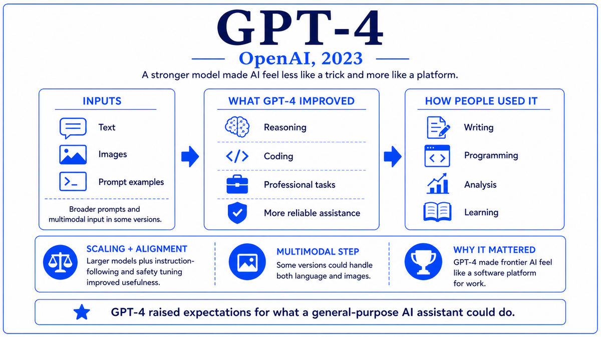

  

  <a href="https://arxiv.org/pdf/2212.08073">📄 Original Paper (Anthropic, December 2022)</a> · Yuntao Bai and the Anthropic team, including co-founders Dario Amodei (Born Italy, 1983), Daniela Amodei (Born United States), Tom Brown, Sam McCandlish, Jack Clark, Jared Kaplan, and Chris Olah

<em>In early 2021, seven senior researchers left OpenAI together. They believed the field was moving faster than its alignment work, and they wanted to do that work in a different setting. Two years later, on the same day OpenAI released GPT-4, they released their own frontier model. They called it Claude.</em>

---

In late 2020, a group of senior researchers at OpenAI began discussing their concerns about the trajectory of frontier AI development. Capabilities were advancing rapidly, and the empirical scaling laws had made the next few years of capability gains predictable. What concerned the group was the gap between capability progress and the alignment research needed to ensure that increasingly capable systems would behave reliably and safely. Their analysis was that the gap was widening, and that doing the alignment work properly required a research environment specifically organized around it.

In early 2021, seven of them left OpenAI together to found a new lab. The leaders were the siblings Dario and Daniela Amodei. Dario, born in Italy in 1983, had been Vice President of Research at OpenAI and had led the GPT-2 and GPT-3 efforts. Daniela had previously worked at Stripe as a manager and had moved to OpenAI as VP of Operations. The other co-founders included Tom Brown, who had been the lead author of the GPT-3 paper, Sam McCandlish, Jack Clark, Jared Kaplan, who had authored the scaling laws paper, and Chris Olah, who had founded much of the modern field of mechanistic interpretability. The new company was called Anthropic. It was incorporated as a public benefit corporation, with explicit charter language identifying AI safety research as a primary purpose.

Anthropic raised an initial Series A of approximately 124 million dollars in 2021, with subsequent rounds bringing total raised capital into the billions through 2023, including major investments from Google and Amazon. The company spent its first two years building training infrastructure and conducting alignment research before releasing a public product. The pace was slower than OpenAI's, deliberately so. The internal view was that releasing a frontier model required substantial dedicated safety work first.

The technical foundation of the eventual product was published in December 2022. The paper, titled "Constitutional AI: Harmlessness from AI Feedback," with Yuntao Bai as first author, introduced an alternative to the RLHF pipeline that OpenAI had used. Constitutional AI, abbreviated CAI, replaced much of the human feedback labor with AI feedback guided by an explicit written set of principles called the constitution. The constitution stated, in plain English, what kinds of behavior the model should exhibit and avoid. The model itself would critique its own outputs against these principles and revise them, then pairs of revised outputs would be evaluated by an AI judge using the same constitution to produce preference labels for reinforcement learning.

On March 14, 2023, Anthropic publicly launched Claude. The release coincided with OpenAI's announcement of GPT-4 the same day. The two frontier model labs, with their distinct technical approaches and institutional cultures, both reached public release on the same Tuesday. Claude was initially available to selected partners through an API and through a chat interface. Reviewers compared it favorably to GPT-3.5 and noted that it was particularly strong at long-form reasoning and at refusing harmful requests gracefully. The CAI approach, in early evidence, appeared to work.

  

<em>Written principles, model self-critique, then RL from AI feedback. Most of the human labor of RLHF replaced by an AI evaluator working from an explicit constitution.</em>

---

Claude and Anthropic mattered for three reasons that shaped frontier AI from 2023 onward.

First, Anthropic established a distinct institutional pole in frontier AI development. Before Anthropic, the dominant frame was OpenAI versus academic labs versus other corporations. After Anthropic, the frame became OpenAI versus Anthropic versus Google DeepMind versus Meta, with each lab having a recognizable culture, technical signature, and public position on AI development. Anthropic's specific signature, the safety-first framing combined with public benefit corporation governance, gave the public and policymakers a meaningfully different option to compare against. Within two years, this distinct framing influenced regulation, corporate AI strategy, and public conversation about AI development.

Second, Constitutional AI demonstrated a practical alternative to RLHF that scaled differently. RLHF requires substantial human labeling effort that grows with the size of the alignment dataset. CAI replaced much of that with AI feedback, with humans contributing primarily to writing and refining the constitution. The approach was not purely better, since the quality of the constitution and the calibration of the AI judge introduced their own challenges. But it offered a different path, with different scaling properties and a more transparent locus of value specification. Within two years, variants of CAI, RLAIF, and direct preference optimization had displaced pure RLHF as the standard alignment recipe in most major labs.

Third, the three-frontier-lab dynamic of OpenAI, Anthropic, and Google DeepMind, with Meta as a fourth player from a different angle, created competitive pressure that benefited the entire field. Each lab pushed the others to release more capable models faster, while also pushing on safety, evaluation, and deployment quality. The Claude family went through several generations through 2023, 2024, 2025, and into 2026. Users who wanted to compare answers across frontier models could do so trivially, and the convergent feedback loop produced rapid capability and safety progress simultaneously.

---

The defining concept of Constitutional AI is that the values guiding model behavior should be specified explicitly, in writing, rather than implicitly through patterns of human preferences. The constitution is a set of principles, written in natural language, that describe how the model should behave. Examples of constitutional principles might include "Choose the response that is most helpful, harmless, and honest" or "Choose the response that respects human autonomy" or "Choose the response that does not encourage illegal activity." The principles are intended to be auditable, meaning that anyone can read them and assess whether they reflect appropriate values, in a way that is impossible with patterns implicit in unlabeled human preferences.

The CAI training pipeline operationalizes this in two phases. The supervised phase begins with a base language model and a set of prompts. For each prompt, the model generates a response. The model is then asked to critique its own response against a randomly chosen constitutional principle. The critique is supposed to identify ways in which the response fails to satisfy the principle. The model is then asked to revise the response in light of the critique. The original prompt and the revised response form a training pair. The model is fine-tuned on these pairs by supervised learning, becoming, in effect, a model that produces revised responses directly.

The reinforcement learning phase uses the supervised model to generate response pairs and uses an AI judge, prompted with a constitutional principle, to select the better response. The AI judge plays the role that human labelers play in RLHF. The result is a dataset of preference comparisons that look like RLHF data but were generated without human labels. A reward model is trained on these preferences. The supervised model is then optimized by reinforcement learning against this reward model, exactly as in standard RLHF.

The conceptual claim is that this pipeline can produce models with comparable or better behavioral quality to RLHF-trained models, with less human labeling effort and with more transparent value specification. The empirical evidence in the original paper and subsequent work suggests that the claim holds for many alignment dimensions. The CAI framework is best viewed as an alignment technique with distinct properties from RLHF rather than a strict improvement over it.

---

The Constitutional AI pipeline can be summarized as follows. Start with a helpful-only language model, fine-tuned to be helpful but without harmlessness alignment. The supervised phase generates training pairs (x, y_revised) by running the model in the loop. For prompt x, generate response y. Then prompt the model with y plus a critique request based on a sampled constitutional principle, producing critique c. Then prompt the model with x, y, and c plus a revision request, producing revised response y_revised. Train a new model on (x, y_revised) pairs by supervised learning.

The reinforcement learning phase uses the supervised model to generate two responses y_a and y_b for each prompt x. An AI judge model is prompted with x, y_a, y_b, and a sampled constitutional principle, and asked to select the preferred response. This produces a preference dataset (x, y_w, y_l) where y_w is the AI-preferred response and y_l is the dispreferred one. A reward model r_phi is trained on this dataset using the same Bradley-Terry preference loss as in RLHF. The supervised model is then optimized by PPO with the reward signal from r_phi and a KL penalty against the supervised reference, identical in structure to the RLHF RL phase.

The Claude family has gone through several generations since 2023. Claude 2 in July 2023 expanded context length to 100,000 tokens. The Claude 3 family in March 2024 introduced a tiered structure of Haiku, Sonnet, and Opus, ranging from smallest to most capable. Claude 3.5 Sonnet in June 2024 added computer-use capabilities. Claude 3.7 Sonnet in February 2025 added explicit reasoning. The Claude 4 family launched in May 2025, followed by Claude 4.5 and 4.6 in late 2025, and Claude 4.7 Opus in early 2026, the current most capable model in the family.

---

Anthropic's institutional and technical position has continued to develop alongside the broader frontier AI field. The company has grown to several thousand employees by 2026, with funding rounds bringing total raised capital into the tens of billions of dollars. The Claude API serves enterprise customers across legal, financial, healthcare, and software development. Anthropic's interpretability research, led by Chris Olah's group, has produced influential work on understanding the internal mechanisms of large language models. The company's policy team has been a leading voice in conversations about frontier AI regulation and responsible scaling.

The frontier AI landscape that crystallized in 2023 has remained recognizably similar through the years that followed. OpenAI, Anthropic, Google DeepMind, and Meta have continued to release frontier models every six to twelve months. xAI from Elon Musk and a number of Chinese labs including DeepSeek, Alibaba, and Tencent have joined the frontier set. The competitive dynamics have remained vigorous, and the public benefits from the collective progress.

But the most consequential competitive shift of mid-2023, as GPT-4 and Claude were both reaching the market, was about to come from a different direction entirely. Meta had been training its own large language models throughout 2022 and into 2023. The original Llama in February 2023 had been released only to academic researchers under a restrictive license. The next version, due in July 2023, would be different. Meta would release Llama 2 with weights publicly available under a commercial-friendly license. The open-weights revolution that Stable Diffusion had begun for images was about to come to language.

---

  <a href="2023a-OpenAI-GPT-4.md">← Previous: GPT-4 2023</a> &nbsp;·&nbsp; <a href="2023c-Meta-Llama.md">Next: Llama 2023 →</a>

