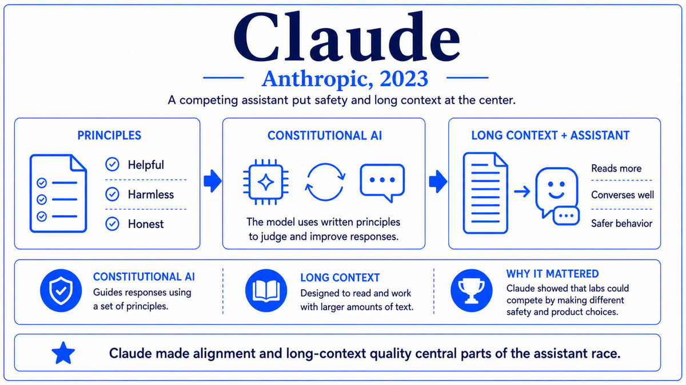

  

  <a href="https://arxiv.org/pdf/2307.09288">📄 Original Paper (Meta, July 2023)</a> · Hugo Touvron (Born France) and the Meta AI team, with strategic direction from Mark Zuckerberg (Born White Plains, New York, United States, 1984), Meta Platforms, Menlo Park, California

<em>Stable Diffusion had brought open weights to image generation. ChatGPT had brought language models to the public. Meta brought the two together. In July 2023, the company released a frontier-class language model with weights anyone could download and use commercially.</em>

---

In February 2023, Meta AI released the original Llama. The model was trained at sizes ranging from 7 billion to 65 billion parameters, with performance competitive with much larger closed models on standard benchmarks. The release was research-only. Researchers had to apply for access, sign a non-commercial license, and wait for approval. Within days of release, the weights leaked publicly, distributed through 4chan and BitTorrent. The community downloaded them, ran them on consumer GPUs, and began producing fine-tunes and derivatives. The leak was an embarrassment for Meta but also a revelation. There was clearly enormous demand for frontier-class open-weight language models, and the world was ready to use them.

The decision Meta made next was unusual for a major technology company. Rather than tighten security and treat the leak as a setback, the company decided to lean into open release. The strategic call came from Mark Zuckerberg, born in White Plains, New York, in 1984. Meta's leadership viewed the AI race differently from OpenAI and Google. The other labs were building closed services. Meta's business model was based on advertising on social platforms, not on selling AI as a service. Open weights cost Meta nothing in direct revenue and gave the company a distinctive position in the broader AI ecosystem. The company would release its frontier work openly, build the developer community around its models, and benefit indirectly from the resulting ecosystem.

The result was Llama 2, released on July 18, 2023. The lead author of the technical paper was Hugo Touvron, born in France, a Meta AI researcher who had also led Llama 1. The author list ran to over fifty people. The model was released in three sizes: 7 billion, 13 billion, and 70 billion parameters. The weights were available for download under a custom license that permitted commercial use for any organization with fewer than 700 million monthly active users, effectively excluding only the largest competitors. The training corpus had been expanded to 2 trillion tokens. The chat versions had been fine-tuned with a combination of supervised fine-tuning and RLHF. The largest 70-billion-parameter model was competitive with GPT-3.5 on many benchmarks, although still behind GPT-4 across most tasks.

The reception was extraordinary. Within hours of release, the weights had been downloaded thousands of times. Within days, fine-tuned variants were appearing on Hugging Face. Within weeks, an ecosystem of derivative models had formed. Vicuna, Alpaca, Code Llama, MedAlpaca, and a long list of others built on the Llama 2 base. Companies that had been waiting for an open frontier model could now deploy one in their own infrastructure, with full control over the weights and the data flowing through them. Llama 2 became, almost overnight, the default starting point for open-weights LLM development.

Meta continued the release cadence. Llama 3 in April 2024 introduced an 8-billion and a 70-billion parameter version with substantially improved capabilities. Llama 3.1 in July 2024 released a 405-billion parameter model, the first openly released model to seriously rival the closed frontier. Llama 3.2 in September 2024 added vision and small mobile-friendly variants. Llama 4 in April 2025 transitioned to a mixture-of-experts architecture. With each release, Meta's commitment to open weights remained, and with each release, the open ecosystem grew.

  

<em>One open release. An ecosystem within weeks. The pattern that came to language modeling from Stable Diffusion's image-generation playbook.</em>

---

Llama mattered for three reasons that reshaped the AI ecosystem from 2023 onward.

First, it brought frontier-class language models into open availability. Before July 2023, the only way to use a competent large language model was to call OpenAI's, Anthropic's, or Google's APIs. After July 2023, anyone could download Llama 2 70B and run it on their own hardware. The implications cascaded through every domain that used AI. Hospitals could deploy LLMs without sending patient data to external APIs. Defense contractors could deploy them without leakage concerns. Researchers could study them without API rate limits. Developers in countries without API access could build with them anyway. The shift from API-only to weights-available was a fundamental change in who could participate in AI development.

Second, it created a competitive pole that pushed every other lab to consider their open-versus-closed strategies. The closed labs had to justify their pricing against free alternatives. The open community had a flagship to organize around. Other major releases from Mistral, DeepSeek, Alibaba's Qwen, and Google's Gemma all followed the open-weights pattern in subsequent years, often citing Llama as the precedent. Within two years, "open weights" was an established and serious frontier alongside closed APIs. Meta had successfully created a distinct strategic axis in the field.

Third, the Llama ecosystem became the substrate of academic AI research. Pre-2023 academic researchers in NLP had been increasingly priced out of the frontier, unable to afford the API costs or the training compute needed to study state-of-the-art models. Llama gave them weights to study. By 2024, much of the published research on LLM behavior, capabilities, alignment, and interpretability was being done on Llama variants because they were the only frontier-class models available for unrestricted study. The open ecosystem supplied not just commercial deployments but the raw material of academic AI research itself.

---

The defining concept of Llama is open weights as a strategic and technical choice with consequences that close-source distribution does not have. The technical aspects of Llama are largely inherited from prior work. Decoder-only transformer, RMSNorm, SwiGLU activations, rotary position embeddings, grouped-query attention. These are all components developed elsewhere and combined effectively in Llama. The novelty is not in the architecture but in the release decision.

Open weights changes what a model is. A closed-weights model is a service, accessed through an API, with policies that the provider can change at any time. An open-weights model is a software artifact, downloadable, modifiable, and runnable on any hardware. The two have different properties for users. Closed weights guarantee a stable provider-managed service but give the user no control over the model itself. Open weights give the user full control but no service-level guarantees, requiring the user to manage their own infrastructure.

The license matters enormously. Research-only licenses, like Llama 1's, prevent commercial use and limit ecosystem development. Restrictive commercial licenses, like Llama 2's exclusion of organizations over 700 million monthly active users, allow most use cases but reserve protection against the largest direct competitors. Fully permissive licenses, like Mistral's Apache 2.0 releases, allow any use including by direct competitors. The choice of license shapes the resulting ecosystem in significant ways. Llama 2's license was permissive enough to drive an explosion of derivative work while still excluding Meta's most direct competitors.

The deeper conceptual implication is that open weights changes the social organization of AI research and deployment. Closed-source AI concentrates capability in a few corporations. Open-source AI distributes capability widely, with attendant benefits for innovation and risks around misuse. The debate about which mode is better for the long-term trajectory of AI is one of the major unresolved policy questions of the era. Llama did not settle that debate, but it made open frontier AI a real option that policy and corporate strategy had to take seriously.

---

Llama 2's architecture is a decoder-only transformer with several refinements over the original 2017 design. RMSNorm replaces standard layer normalization, providing similar regularization with simpler computation. SwiGLU activations replace ReLU in the feedforward sublayers, improving training dynamics. Rotary position embeddings replace absolute or learned positional encodings, providing better generalization to longer contexts. The 70-billion-parameter model uses grouped-query attention, where multiple query heads share a smaller number of key and value heads, reducing memory bandwidth requirements during inference.

The model sizes are 7 billion, 13 billion, and 70 billion parameters. The 7-billion model has 32 layers with hidden dimension 4,096. The 13-billion has 40 layers with hidden dimension 5,120. The 70-billion has 80 layers with hidden dimension 8,192. Context length is 4,096 tokens. The vocabulary is 32,000 BPE tokens.

Training used 2 trillion tokens of curated text data, double the size of Llama 1's training set. The data mixture was not fully disclosed but included web text, code, books, and academic papers in proportions broadly similar to other major LLM training corpora. Pretraining ran on Meta's A100 GPU clusters, with the 70-billion model taking approximately 1.7 million A100-hours.

The chat versions used a multi-stage post-training pipeline. Supervised fine-tuning on a curated set of high-quality instruction-following demonstrations. Reward model training on human preference comparisons. Reinforcement learning with PPO and rejection sampling. The post-training was considerable, with multiple iterations of rejection sampling and PPO.

---

The Llama ecosystem grew explosively through 2023 and 2024. Hundreds of fine-tuned variants appeared on Hugging Face within months of Llama 2's release. Specialized variants emerged for code, medicine, law, and specific languages. Companies like Together AI, Replicate, and Anyscale built businesses around hosting open Llama deployments. The open frontier became a serious competitor to closed APIs across many use cases.

Subsequent Llama releases continued the trajectory. Llama 3 in April 2024 was a substantial capability upgrade. Llama 3.1 in July 2024 included a 405-billion parameter model that matched closed frontier models on many benchmarks, the first openly released model to do so. Llama 4 in April 2025 transitioned to a mixture-of-experts architecture with multiple variants. Through these releases, Meta cemented its position as the dominant open-weights AI lab. Other labs followed. Mistral, DeepSeek, Alibaba's Qwen, and Google's Gemma all became significant open-weights releases over 2023 and 2024.

But while Meta was building open language models and Anthropic and OpenAI were building closed ones, a different frontier was opening. Video generation had made slow progress through the early 2020s. Generative video had been brief, low-resolution, and limited in scope. By late 2023, several labs were pushing on the problem with diffusion-based approaches and large-scale training. In February 2024, OpenAI would announce a system that produced minute-long, 1080p video from text prompts, with a quality that startled the field. The system was called Sora.

---

  <a href="2023b-Anthropic-Claude.md">← Previous: Claude 2023</a> &nbsp;·&nbsp; <a href="2024a-OpenAI-Sora.md">Next: Sora 2024 →</a>

