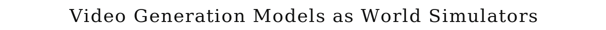
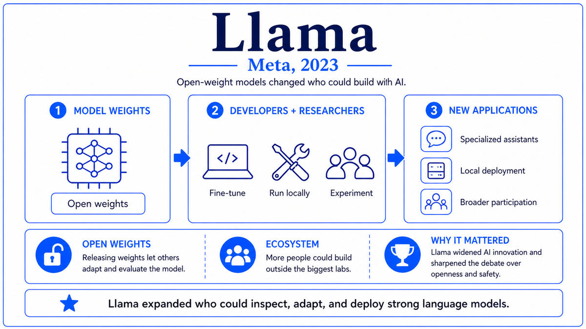

  

  <a href="https://openai.com/index/video-generation-models-as-world-simulators/">📄 Technical Report (OpenAI, February 2024)</a> · Tim Brooks (Born United States), Bill Peebles (Born United States), and the Sora team, OpenAI

<em>For two decades, video generation had been the open frontier of generative AI. In February 2024, OpenAI showed a minute of 1080p video generated from a single sentence of text, and the field saw what was now possible.</em>

---

Video generation had been making steady but unspectacular progress through the early 2020s. Make-A-Video from Meta in September 2022 produced clips a few seconds long at limited resolution. Imagen Video from Google later that year improved quality but kept clips short. Stable Video Diffusion from Stability AI in late 2023 brought open-source video diffusion to the community, but the outputs remained brief and visually constrained. Generating video that was long, coherent, high-resolution, and physically plausible all at once seemed several years away.

OpenAI's Sora team had been working on the problem since at least 2022. The lead researchers were Tim Brooks and Bill Peebles, both born in the United States. Brooks had done his PhD at UC Berkeley, working on diffusion models and image-to-image translation. Peebles had done his PhD at Berkeley as well and had been the lead author of the original Diffusion Transformer paper, called DiT, in late 2022. The DiT paper had shown that the U-Net used in image diffusion could be replaced with a transformer architecture, with significant scaling advantages. Sora was, in essence, DiT scaled up dramatically and applied to video.

The architecture had two key design choices. First, video was compressed into a latent representation by a video autoencoder, much as Stable Diffusion compressed images into spatial latents. The Sora autoencoder produced space-time latents, with both spatial dimensions and a temporal dimension compressed simultaneously. A clip of video became a 3D tensor of latent codes. Second, the diffusion model was a transformer that operated on patches of the space-time latent. The patches were treated as a flat sequence of tokens, and self-attention let any patch attend to any other, regardless of where in space or time it was located. This was the same recipe that had worked for language and for images, applied to a third modality.

The training corpus was enormous and largely undisclosed. Sora was reported to have been trained on a combination of internet video, synthetic data generated through video games and graphics engines, and curated proprietary content. Each video was annotated with high-quality text descriptions, generated by a captioner model that itself had been trained to produce dense, detailed descriptions of video content. The captioning step was reported to be a significant contributor to Sora's text-following accuracy. The model could generate video at resolutions up to 1920 by 1080 and durations up to 60 seconds in a single forward pass.

The technical report and demos were released on February 15, 2024. The demonstrations were striking. A woman walking through Tokyo at night, the camera following her with proper depth-of-field effects. A historical Lagos market scene with consistent characters and lighting across the full minute. A papercraft underwater world with consistent physics and light interaction. The output was not perfect. Hands and small objects sometimes showed standard generative-model artifacts. Physics could fail in subtle ways. But for one-minute, 1080p, text-conditioned video generation, the outputs were a generational leap. Sora was made publicly available as Sora Turbo on December 9, 2024.

  

<em>The latent diffusion recipe extended from images to space-time. Same architecture, same scaling laws, a third modality.</em>

---

Sora mattered for three reasons that defined video generation as a frontier modality.

First, it established a new performance ceiling for video generation that other labs had to match. Within months of the Sora announcement, Google released Veo, Meta released Movie Gen, Runway released Gen-3, and Chinese labs released Kling and others. Each release pushed the state of the art forward, and each was implicitly or explicitly compared to Sora. The video generation arms race that Sora triggered moved the entire field forward by what would have taken several years at the prior pace. By late 2024, video generation had become a normal frontier capability that every major lab needed to demonstrate.

Second, Sora validated the Diffusion Transformer as the architecture for high-quality generative modeling at scale. The DiT had been an academic improvement over the U-Net in late 2022. Sora demonstrated that DiTs scaled to billions of parameters and minute-long video sequences, producing results that no U-Net architecture had matched. Within a year, DiT-based architectures had displaced U-Nets across most new image and video generation systems. Stable Diffusion 3 used a DiT. Flux, the major open image model released in 2024, used a DiT. The architectural shift was as decisive as the move from convolutional networks to transformers had been in language a few years earlier.

Third, Sora reframed what video generation was conceptually. The OpenAI technical report was titled "Video generation models as world simulators." The argument was that to generate plausible video, the model had to acquire implicit knowledge of physical objects, their persistence over time, lighting, optics, and the basic regularities of the visual world. Sora's outputs showed signs of all of these. Object permanence across occlusions. Approximately correct lighting under camera movement. Plausible physics in many scenes. The framing of generative video models as approximate world simulators became a serious research direction, with implications for embodied AI, robotics, and scientific simulation that researchers continue to work out.

---

The defining concept of Sora is the application of latent diffusion at scale to space-time. The recipe is a direct extension of what had worked for images. Compress the data into a smaller latent space using an autoencoder. Run diffusion in that latent space using a transformer that operates on patches. Condition the diffusion process on text using cross-attention or in-context tokens. The novelty is that the third dimension is time, and that the whole pipeline scales smoothly to long, high-resolution sequences.

Space-time patches are the unit of computation. A 60-second 1080p video at 24 frames per second is approximately 1.5 billion pixels in raw form, far too many for direct diffusion. The Sora autoencoder compresses this into a much smaller 3D grid of latent values. The Diffusion Transformer then operates on patches of this grid, where each patch is a fixed-size cube of latents. The patches are flattened into a sequence and processed by self-attention, producing space-time interactions among any pair of patches in a single attention operation.

The scale flexibility of the patch representation is a significant advantage. Earlier video models had typically been trained at fixed resolutions and durations, with separate models for different aspect ratios and lengths. Sora handled variable resolutions, aspect ratios, and durations within a single model by varying the number of patches that made up a sequence. A short low-resolution clip used few patches. A long high-resolution clip used many. The transformer attention mechanism handled both naturally, and the training procedure exposed the model to a wide range of formats, producing a model that could generate at any of them.

The text conditioning piece used a similar approach to Stable Diffusion's. A text encoder produced contextualized embeddings of the prompt, and these were injected into the diffusion process through cross-attention layers. The captioner model used to annotate the training data was reported to produce particularly dense and detailed descriptions, which contributed to Sora's strong text-following capability.

---

The Sora architecture is a Diffusion Transformer operating on space-time patches of compressed video latents. The video autoencoder maps a video x of shape T by H by W by 3 to a latent z of shape t by h by w by c, where the temporal compression factor and spatial compression factors are both substantial. Specific compression ratios were not disclosed, but the latent dimensionality is a small fraction of the input pixel count.

The Diffusion Transformer operates on patches of the latent. A patch is a fixed-size cube of latent values, typically 1 by 2 by 2 in latent units. Patches are flattened into a 1D sequence, and a learnable position embedding plus a timestep embedding are added. The transformer applies self-attention across the entire sequence, allowing any patch to interact with any other regardless of its space-time position. Cross-attention layers inject text conditioning. The network is trained with the standard diffusion noise-prediction objective.

The total parameter count of Sora was not disclosed. Public estimates place it in the range of several billion to tens of billions. Training compute was substantial but unspecified. Inference for a one-minute 1080p video takes several minutes on production hardware, considerably longer than for image generation but much shorter than the duration of the generated video.

The training data combined real-world internet video, synthetic data generated from graphics engines, and curated content. The captioning step used a captioner model trained to produce detailed descriptions of video content, a technique borrowed from DALL-E 3's improved caption quality.

---

The video generation arms race that Sora triggered produced rapid progress through 2024 and into 2025. Veo from Google in May 2024 matched Sora's quality for many categories of content. Movie Gen from Meta in late 2024 added editing capabilities. Runway's Gen-3 family pushed open commercial use. Kling, Hailuo, and other Chinese systems entered the market with competitive results. By 2025, high-quality minute-long text-to-video generation was a commodity capability available across a half-dozen major systems.

The world-simulator framing has continued to develop. Researchers have explored using video generation models as physics simulators, environment models for robotics, and dataset generators for embodied AI. Whether generative video models can serve as a substitute for or supplement to physics-based simulation remains an active research question, with implications across robotics, autonomous vehicles, and scientific computing.

But while OpenAI was extending the frontier into video, the company had been working in parallel on a different direction entirely. The frontier of language models had hit a recognizable plateau. Pretraining had been scaling for years. Fine-tuning and RLHF had been refined. The standard recipe was producing diminishing returns. A different scaling axis had been visible in the literature for some time, traceable back to Wei's chain-of-thought paper in 2022, but it had not been fully exploited at frontier scale. In September 2024, OpenAI would release a model that did exploit it. They called it o1, and it changed what people meant when they said a language model was thinking.

---

  <a href="2023c-Meta-Llama.md">← Previous: Llama 2023</a> &nbsp;·&nbsp; <a href="2024b-OpenAI-o1.md">Next: o1 2024 →</a>

