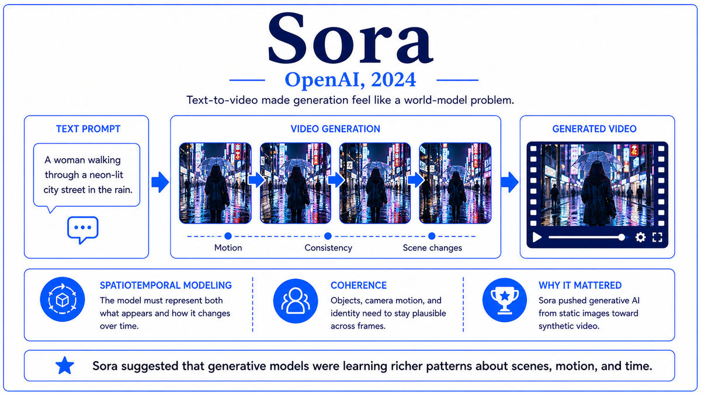

  

  <a href="https://openai.com/index/learning-to-reason-with-llms/">📄 Technical Report (OpenAI, September 2024)</a> · The OpenAI o1 team, building on chain-of-thought work by Jason Wei (Born United States) and colleagues at Google Brain

<em>The pretraining scaling curve had been the dominant axis of frontier AI for five years. In September 2024, OpenAI introduced a new axis. Spend more compute at inference time, let the model think longer, and capability climbs again. The reasoning era began.</em>

---

By 2024, the main scaling axis of frontier AI had been the same for years. Pretrain a larger model on more data with more compute, then fine-tune and align. The Kaplan and Chinchilla scaling laws had quantified the returns to this approach, and the practice had carried the field from GPT-2 in 2019 through GPT-4 in 2023. By 2024, the curves were beginning to flatten. Doubling the pretraining compute was no longer doubling the apparent capability. The next jump was unclear.

A different scaling axis had been visible in the literature for some time. In January 2022, Jason Wei and colleagues at Google Brain had published a paper titled "Chain-of-Thought Prompting Elicits Reasoning in Large Language Models." The technique was simple. Instead of asking the model directly for an answer, prompt it to "think step by step" before answering. The model would produce intermediate reasoning steps and arrive at better final answers, especially on math and logic problems. The improvement was substantial. On grade-school math problems, GPT-3-level models went from solving 18 percent of problems to over 50 percent. On harder reasoning benchmarks, the improvements were similar.

The chain-of-thought finding was widely adopted as a prompting technique. But it raised a deeper question. If letting the model produce reasoning before answering improved performance so much, could a model be trained specifically to do this well, with reinforcement learning rewarding correct reasoning rather than just correct answers? Several research groups began exploring this direction. Within OpenAI, a project to build a reasoning-trained model had been underway since at least 2023, with the internal codename Q-star and later Strawberry. The senior leadership of the project included researchers who had worked on AlphaGo's planning architectures and on RLHF.

The result was o1, released to ChatGPT Plus subscribers as a preview on September 12, 2024. The full o1 model and o1 Pro were released in December 2024. The model's defining feature was that it produced extensive internal reasoning before answering. On simple questions, it answered quickly. On hard questions, it might think for tens of seconds, sometimes minutes, producing thousands or tens of thousands of tokens of internal reasoning that the user never saw. The visible answer was preceded by a hidden chain of thought that the model had produced and that it had been trained to use effectively.

The benchmark results were striking. On AIME 2024, a competition mathematics exam, GPT-4o scored 13 percent. The o1 preview scored 56 percent. The full o1 scored 83 percent. On GPQA Diamond, a benchmark of PhD-level science questions, o1 reached 78 percent, exceeding the average score of human PhD-holders in the relevant fields. On Codeforces competitive programming, o1 reached the 89th percentile of human competitors. The pattern was consistent. On tasks where extended reasoning helped humans, it helped o1 even more, and o1 cleared benchmarks that had been considered out of reach for language models.

  

<em>A second scaling axis. Train-time compute on one side, test-time compute on the other. Both produce capability gains.</em>

---

o1 mattered for three reasons that defined a new direction in frontier AI.

First, it established inference-time compute as an independent scaling axis. Before o1, the question of how much capability a model would have was largely a question of how much was spent on pretraining. After o1, a second lever existed. A model could be cheaper to train but use more compute per query at inference time, with capability climbing as a function of how much it thought. The two axes scaled differently and could be traded off in different ways for different applications. Within months, every major lab was working on reasoning-trained models. Anthropic released Claude 3.7 Sonnet with extended thinking in February 2025. Google released Gemini 2.0 Flash Thinking. DeepSeek released R1 in January 2025. The reasoning model paradigm became universal across the frontier within six months of o1's release.

Second, o1 demonstrated that reinforcement learning on reasoning chains could substantially improve frontier model performance on quantitative tasks. The technique combined chain-of-thought prompting, which was a known prompting technique, with RL training that rewarded the production of effective reasoning chains. The combination produced gains far beyond what either component had achieved alone. The methodology validated a research direction that had been explored academically for years and made it the new standard recipe.

Third, o1 reopened the question of where the limits of language model capability actually lie. Frontier models had been showing signs of plateau through early 2024. The o1 results showed that significant capability gains were available on a different axis, with no obvious ceiling visible. The implications cascaded across the field. Researchers who had been concluding that scaling was running out had to revise that view. The compute-for-capability tradeoff became more flexible, with implications for everything from chip design priorities to investment decisions to safety considerations.

---

The defining concept of o1 is inference-time reasoning as a trainable capability. Earlier language models produced answers through a single forward pass, with reasoning either implicit in the weights or explicit only when prompted. o1 was trained specifically to use extended internal reasoning, with reinforcement learning rewarding reasoning chains that led to correct answers. The result is a model that thinks before answering, with thinking duration adapted to problem difficulty.

The training procedure differs from RLHF in important ways. RLHF rewards model outputs that humans prefer, with a single response per query. Reasoning training rewards model outputs that arrive at correct answers, with extended internal reasoning before the answer. The reward signal often comes from automatic verification rather than human preferences, particularly for math problems where the correct answer can be checked, code problems where execution can verify correctness, and logic puzzles with definite solutions. The verifiable reward signal scales much better than human labeling, because correct answers can be generated by the millions for math and code domains. The model learns reasoning strategies that consistently produce correct answers, which often involve techniques like backtracking, sub-problem decomposition, and self-checking.

The hidden chain-of-thought is a deliberate design choice. o1's internal reasoning is not shown to users in full. OpenAI cited two reasons. First, the raw reasoning chains include the model exploring incorrect paths, considering and rejecting hypotheses, and engaging in patterns of thought that would be confusing or misleading if displayed directly. Second, hiding the reasoning preserves a competitive advantage and reduces the risk of distillation by competitors. The user sees only a summary of the reasoning and the final answer. Critics argue this opacity reduces interpretability and trust. Supporters argue it allows the reasoning training to optimize for correctness without distortion from how the chain looks.

The conceptual significance of inference-time scaling is that it changes what a model is. A traditional language model is a fixed function from input to output. A reasoning model is a system that, given a problem, allocates compute proportional to the problem's difficulty. Hard problems get more thinking. Easy problems get less. The user can also explicitly request more thinking time for harder problems. This dynamic compute allocation is qualitatively different from the fixed-cost forward pass of earlier models, and it has implications for how AI systems will be deployed and priced.

---

The architectural details of o1 have not been disclosed. OpenAI cited competitive and safety reasons for the limited technical disclosure, continuing the pattern established with GPT-4. What is publicly known about the training procedure comes from technical blog posts and partial discussions in the system card.

The training combines large-scale pretraining with reinforcement learning specifically targeted at reasoning. The pretrained base model is reported to be roughly comparable in scale to GPT-4o. The RL phase trains the model to produce reasoning chains, with the reward signal based on the correctness of the final answer for problems where correctness can be automatically verified. The model is trained on a curriculum that includes mathematics, code generation and execution, scientific reasoning, and other domains where automatic verification is feasible.

The reasoning chains during inference can be very long. For hard problems, o1 may produce tens of thousands of tokens of internal reasoning before producing an answer of a few hundred tokens. The total compute per query can be hundreds or thousands of times the compute of a non-reasoning model on the same query. Pricing reflects this. The o1 API charges substantially more per token than GPT-4o, and the visible answer represents only a fraction of the tokens actually generated and billed.

The benchmark results are well-documented even if the architecture is not. On the AIME 2024 mathematics competition, o1 scored 83 percent. On GPQA Diamond science questions at PhD level, 78 percent. On the Codeforces competitive programming benchmark, the 89th percentile of human competitors. On formal mathematics through the IMO 2024 problems, o1 partially solved several problems that no prior language model had been able to handle. The capability profile favored quantitative and logical tasks where reasoning chains could be verified, with smaller gains on tasks where such verification was not available.

---

The reasoning paradigm spread quickly across the frontier. Claude 3.7 Sonnet from Anthropic in February 2025 introduced extended thinking with user-controllable reasoning depth. Gemini 2.0 Flash Thinking from Google appeared in late 2024. DeepSeek R1 from a Chinese lab in January 2025 produced an open-weights reasoning model with comparable benchmark performance to o1, at a small fraction of the reported training cost. By mid-2025, every major frontier model had a reasoning variant, and reasoning capability was a standard category in model evaluations.

The implications for hardware were significant. Reasoning models spent much more compute per query than traditional language models. Inference infrastructure had to scale accordingly. The compute-per-query economics shifted, with implications for cloud pricing, deployment models, and chip design priorities. NVIDIA began emphasizing inference performance as much as training performance in the marketing of new chips.

The most significant immediate consequence of the reasoning era was that 2025 became the year of two parallel hardware-and-algorithm stories. On the hardware side, NVIDIA was preparing to launch Blackwell, the largest and most aggressive GPU design in the company's history, targeted at the compute demands of reasoning models and trillion-parameter training runs. On the algorithm side, a Chinese lab named DeepSeek was about to demonstrate that competitive reasoning capability could be achieved with a small fraction of the compute that frontier American labs were spending. The collision of these two stories on a single Monday in January 2025 would close out Era 08, and this walk along with it.

---

  <a href="2024a-OpenAI-Sora.md">← Previous: Sora 2024</a> &nbsp;·&nbsp; <a href="2025-NVIDIA-Blackwell-DeepSeek.md">Next: Blackwell + DeepSeek-R1 2025 →</a>

