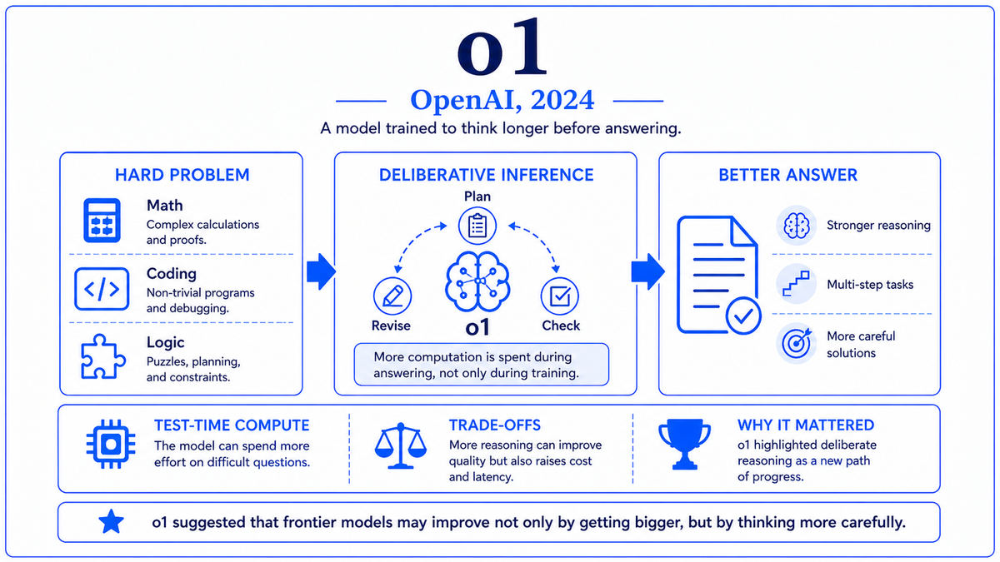

  

  <a href="https://arxiv.org/pdf/2501.12948">📄 DeepSeek-R1 Paper (January 2025)</a> · DeepSeek-AI team, led by Liang Wenfeng (Born China, 1985), Hangzhou, China · NVIDIA Blackwell announced March 2024 by Jensen Huang (Born Tainan, Taiwan, 1963)

<em>On Monday, January 27, 2025, NVIDIA's stock dropped 17 percent and lost nearly 600 billion dollars in market value, the largest single-day loss for any company in stock market history. The cause was a paper from a small Chinese AI lab published the week before. Era 08 closes with the collision of maximalist hardware and unexpected algorithmic efficiency.</em>

---

In March 2024, NVIDIA announced the Blackwell architecture at GTC. Jensen Huang, on stage at the SAP Center in San Jose, held up the new B200 chip alongside the H100 for comparison. The B200 was the largest GPU NVIDIA had ever built. It was not a single die but two reticle-limit-sized dies fused together by a high-bandwidth chip-to-chip interconnect, packaged as a single GPU with 208 billion transistors total, more than 2.5 times the H100's count. The chip was named after David Blackwell, the American mathematician who had been the first Black scholar inducted into the National Academy of Sciences. The architecture continued NVIDIA's tradition of naming generations after foundational figures in mathematics and computing.

Blackwell was designed for the workloads that the post-ChatGPT era had produced. Trillion-parameter mixture-of-experts models. Reasoning models that consumed orders of magnitude more inference compute. Multimodal models with video and audio components. The chip introduced fifth-generation Tensor Cores with native FP4 support, doubling effective throughput over H100's FP8. The Transformer Engine was extended to handle FP4 alongside FP8 and FP16. NVLink 5.0 connected GPUs at 1.8 terabytes per second. The GB200 NVL72 rack-scale system contained 72 Blackwell GPUs in a single coherent NVLink domain, delivering over 1.4 exaFLOPS of FP4 inference. The B200 began shipping in late 2024 and reached full production in early 2025, exactly as the major frontier labs were ramping up their next training rounds.

While NVIDIA was preparing the most maximalist GPU in its history, a smaller lab in China was preparing a different kind of demonstration. DeepSeek was a Chinese AI company founded in July 2023 in Hangzhou by Liang Wenfeng, born in China in 1985. Liang had previously co-founded a quantitative hedge fund called High-Flyer, which had used machine learning for trading and had accumulated significant computing infrastructure. DeepSeek was spun out as a separate research-focused entity. The lab built up a team of mostly young Chinese researchers and began publishing competitive open-weights models throughout 2024.

On January 20, 2025, DeepSeek released DeepSeek-R1, a reasoning model in the style of OpenAI's o1. The release included open weights under an MIT license, a detailed technical paper describing the training procedure, and benchmarks showing performance competitive with or exceeding o1 on several reasoning tasks. The price for inference was a fraction of o1's. Most striking was the reported training cost. DeepSeek claimed that the underlying base model, DeepSeek-V3, had been trained for approximately 5.6 million dollars in total compute, roughly two orders of magnitude less than what frontier American labs were reportedly spending.

The market reaction was delayed. Through the week of January 20, the news spread among AI researchers but had not yet reached the financial markets at scale. Over the weekend of January 25 and 26, mainstream financial press began covering the story. On Monday, January 27, 2025, NVIDIA's stock opened down sharply and continued falling through the day. It closed down 17 percent, losing approximately 593 billion dollars in market capitalization. It was the largest single-day market-cap loss for any company in stock market history. The reason given by analysts was straightforward. If frontier AI capability could be achieved at a fraction of the previously assumed compute cost, the demand for the most expensive AI hardware was uncertain. The thesis that NVIDIA's revenue would scale linearly with frontier AI investment had been called into question.

  

<em>Maximalist hardware on one side. Algorithmic efficiency on the other. The two scaling paths that defined where Era 08 ended.</em>

---

The Blackwell-DeepSeek collision mattered for three reasons that closed out Era 08.

First, it made visible the tension between two paths to frontier AI. The maximalist path, represented by Blackwell and the labs that bought it, treated compute as the primary lever. More transistors, more tensor cores, more memory bandwidth, more interconnect, more datacenters. The efficiency path, represented by DeepSeek and a growing set of similar labs, treated algorithmic and architectural innovation as the primary lever. Better training procedures, smarter data curation, mixture-of-experts efficiency, careful engineering. Both paths produced capable frontier models. The right balance between them, and the implications for the AI hardware industry, became one of the major strategic questions of the year.

Second, DeepSeek's release demonstrated that the open-weights frontier was now competitive with the closed-weights frontier on reasoning. Llama and Mistral had brought open weights to general language modeling. DeepSeek-R1 brought open weights to reasoning models. Within weeks of the release, fine-tunes and derivatives of DeepSeek-R1 were appearing across Hugging Face. Researchers studying reasoning had a frontier-class model whose internals they could examine in detail, in contrast to the carefully sealed o1. The closed-versus-open competitive dynamic, which had defined the language model frontier through 2023 and 2024, was now reproducing itself for reasoning models.

Third, the January 27 stock movement demonstrated that public capital markets had become a participant in AI strategy in a new way. The half-trillion dollar market response to a single technical paper was unprecedented in scale. Financial markets were now pricing AI hardware demand as a function of frontier model economics, and algorithmic improvements at any major lab could move that pricing materially.

---

The defining concept of the 2025 moment is that there are multiple paths to frontier AI, and the relative weights between them are not yet settled. Compute scaling, algorithmic efficiency, data quality, architectural innovation, post-training techniques, and inference-time reasoning are all levers. Different combinations produce different capability and cost profiles. The next phase of the field will be determined in part by which combinations turn out to scale best.

Blackwell represents the compute-scaling lever pushed to its current limit. The B200 chip pairs two reticle-limit dies into a single logical GPU, integrates fifth-generation Tensor Cores with FP4 support, and connects to other Blackwell GPUs through NVLink 5.0 at 1.8 terabytes per second. The GB200 NVL72 system connects 72 of these GPUs into a single NVLink domain, behaving as a unified accelerator. The architectural and packaging choices reflect NVIDIA's bet that frontier AI workloads would continue to demand maximum compute density, maximum memory bandwidth, and tightest possible interconnect.

DeepSeek represents the algorithmic-efficiency lever explored aggressively. The technical contributions of the DeepSeek-V3 and DeepSeek-R1 papers include several specific innovations. Multi-Head Latent Attention reduces the memory footprint of the attention key-value cache during inference. The DeepSeekMoE mixture-of-experts architecture uses fine-grained expert specialization with auxiliary load-balancing losses. The training pipeline uses FP8 mixed precision with carefully controlled accumulation in higher precision. The R1 paper introduced a reinforcement learning procedure called Group Relative Policy Optimization that requires no separate critic model, reducing training compute. None of these innovations alone is dramatic. The combination produces a model that achieves frontier reasoning performance at a small fraction of the assumed cost.

The conceptual implication is that frontier AI capability is not a fixed function of compute alone. The same capability can be reached through very different combinations of compute, data, and algorithmic sophistication. The trade-offs among these have been visible to researchers for years, but the public visibility of the trade-off, and its market consequences, became central in early 2025.

---

The Blackwell B200 GPU contains 208 billion transistors built on TSMC's 4NP process, organized as two dies connected by a 10 terabyte per second chip-to-chip interconnect. Per-chip throughput is 20 petaFLOPS in FP4 with sparsity, 10 petaFLOPS in FP8 with sparsity, and 5 petaFLOPS in BF16 or FP16 with sparsity. Memory is 192 gigabytes of HBM3e per chip with 8 terabytes per second of bandwidth. NVLink 5.0 provides 1.8 terabytes per second of bidirectional bandwidth across 18 links. The GB200 Grace-Blackwell Superchip pairs two B200 GPUs with one Grace CPU. The GB200 NVL72 rack contains 36 Grace-Blackwell Superchips for 72 Blackwell GPUs total, sharing one coherent NVLink domain delivering over 1.4 exaFLOPS of FP4 inference at the rack level.

DeepSeek-V3 is a mixture-of-experts transformer with 671 billion total parameters and 37 billion active per token. The architecture has 61 transformer layers, 256 routed experts plus 1 shared expert per layer, and Multi-Head Latent Attention with 128 attention heads. Context length is 128,000 tokens. Pretraining used 14.8 trillion tokens, processed in FP8 mixed precision on a cluster of approximately 2,048 NVIDIA H800 GPUs (the export-control-compliant variant of the H100 sold in China). The reported training cost is approximately 5.576 million dollars at standard cloud H800 rates.

DeepSeek-R1 is built on top of DeepSeek-V3 with additional reinforcement learning training that targets reasoning tasks. The training procedure begins with a cold-start supervised phase using a small set of high-quality reasoning examples, followed by extended RL on reasoning problems with verifiable rewards using Group Relative Policy Optimization. The resulting R1 model produces extended chains of thought visible to the user, in contrast to o1's hidden reasoning, and matches or exceeds o1 on several reasoning benchmarks at substantially lower inference cost.

---

The aftermath of January 27, 2025 reshaped strategic conversations across the industry. NVIDIA's stock recovered significantly over the following months as the major American labs continued buying Blackwell systems at scale. The compute-scaling thesis was not destroyed, but it was forced to coexist with the efficiency thesis in a way it had not before. Frontier American labs began publishing more aggressively about training efficiency. Chinese labs continued releasing competitive open-weights models. The pattern of two parallel frontiers, one closed and compute-maximalist and one open and efficiency-focused, became increasingly clear through 2025 and into 2026.

The deeper lessons of the moment are still being worked out. AI investment remains enormous. Datacenter buildouts continue at unprecedented scale. Frontier models continue to advance on multiple axes simultaneously. The relative balance between compute and algorithmic efficiency varies by problem, by lab, and by month. The settled understanding of what frontier AI development costs, and how to do it efficiently, is still emerging.

This walk closes here. We started in 1936 with Turing's machine, an abstract definition of computation that established what a computer could ever be. We followed the lineage through neural networks, expert systems, statistical learning, deep learning, and the transformer revolution. We have ended in 2026, with frontier AI systems that read books, write code, generate video, prove mathematics, and reason through novel problems. The story of how the field arrived at this moment is the story this book has tried to tell. The story of what the field becomes from here is the one being written now, paper by paper, release by release, every week.

The long walk continues.

---

  <a href="2024b-OpenAI-o1.md">← Previous: o1 2024</a>

