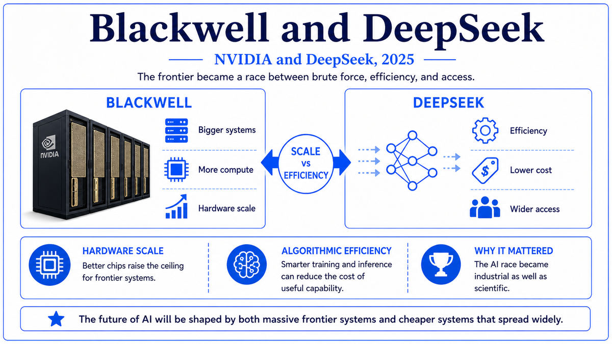
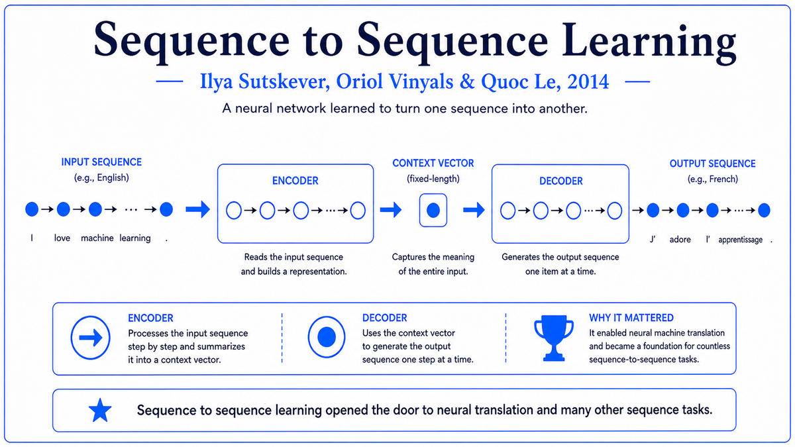

  

  <b>Era</b> · 1936 → 2025 &nbsp;&nbsp;|&nbsp;&nbsp; <b>66 chapters across 8 eras</b> &nbsp;&nbsp;|&nbsp;&nbsp; <b>License</b> · MIT

---

The internet is drowning in writing about AI — its history, its breakthroughs, the technical leaps that brought us here. And yet, somewhere in all of that, a gap remains.

A gap where a curious reader — a teenager just discovering the field, or a seasoned engineer who never had time to look back — can sit down and read the whole thing like a story. One place where the pieces connect. Not a link to a paper buried in a journal. Not a few scattered lines on a Wikipedia page. Not a random collection of names and dates. A deliberate, sequential walk through the moments that mattered — the ones where one idea cracked open the door for the next.

This repo is for everyone — the seasoned researcher, the aspiring one, the student just beginning, the curious mind with no background at all. There are no walls of equations to climb, no jargon to decode. What you&#8217;ll find here is what the scientists themselves wanted the world to understand — the meaning of their work, the spark behind it, and why any of it matters to ordinary life.

---

<table border="0">
  <tr>
    <td width="64" align="center" valign="middle"></td>
    <td><b>A real sense of AI&#8217;s arc</b> — where it came from, where it stands, and where it might be heading.</td>
  </tr>
  <tr>
    <td width="64" align="center" valign="middle"></td>
    <td><b>An appreciation for mathematics</b> — and how it quietly built the foundation for computing.</td>
  </tr>
  <tr>
    <td width="64" align="center" valign="middle"></td>
    <td><b>A grasp of physics</b> — and how its laws gave us the chips that made it all possible.</td>
  </tr>
  <tr>
    <td width="64" align="center" valign="middle"></td>
    <td><b>A feel for the scientists</b> — a handful of minds who, armed with nothing but math and physics, kept pushing past the edge of what calculation could do.</td>
  </tr>
</table>

---

## A Sample of What&#8217;s Inside

  

<em>From <a href="07-Deep-Learning-Awakens-(2000s-2017)/2014c-Bahdanau-Attention.md">Chapter on Attention, 2014</a> — every chapter is built around a custom diagram and the story behind it.</em>

---

## Map of the Journey

| Era | Years | Chapters | Theme |
|---|---|---|---|
| [01 — The Beginning](01-The-Beginning-(1930s-40s)) | 1936-1949 | 10 | Turing, Shannon, the first machines, the first neuron |
| [02 — Birth of AI](02-Birth-of-AI-(1950s)) | 1950-1959 | 6 | The Turing Test, Dartmouth, the perceptron, Lisp |
| [03 — First Wave: Symbolic AI](03-First-Wave-Symbolic-AI-(1960s)) | 1965-1969 | 3 | Moore&#8217;s Law, ELIZA, the perceptrons critique |
| [04 — First AI Winter](04-First-AI-Winter-(1970s)) | 1971-1976 | 6 | The microprocessor, SHRDLU, Prolog, MYCIN |
| [05 — The Comeback](05-Comeback-(1980s)) | 1980-1989 | 5 | Expert systems, Hopfield, backpropagation, ConvNets |
| [06 — The Statistical Era](06-Statistical-Era-(1990s)) | 1991-1999 | 7 | Vanishing gradients, SVMs, LSTM, Deep Blue, PageRank, GPUs |
| [07 — Deep Learning Awakens](07-Deep-Learning-Awakens-(2000s-2017)) | 2006-2017 | 13 | DBN, CUDA, ImageNet, AlexNet, attention, Transformer |
| [08 — The Generative Era](08-Generative-Era-(2018-Today)) | 2018-2025 | 16 | BERT, GPT-3, AlphaFold, ChatGPT, Claude, Sora, o1, Blackwell |

---

**Start at 1936. Walk forward.**

Each chapter is a short, plain-language summary of a landmark paper, theory, or moment that shaped the field — what it was, who made it, why it mattered, and what came next.

A typical chapter takes 10-15 minutes to read. The whole walk, from Turing 1936 to Blackwell 2025, runs about 12-15 hours of reading. Best done in pieces, over weeks, ideally with a coffee.

Each chapter ends with a link to the next one, so once you start, you can just keep walking.

---

## Found a Mistake? Have a Suggestion?

Open an [issue](https://github.com/hgus107/A-Long-Walk-of-AI/issues) or send a pull request. Corrections, missing context, suggested additions — all welcome.

---

<b><em>Welcome.</em></b>

  <a href="01-The-Beginning-(1930s-40s)/1936-Turing-Computable-Numbers.md">First Paper: Turing 1936 →</a>

